## AJ-Report小白配置大屏教程
### 背景
leader 上周周五快下班时给了我一个任务，问我说项目新集成的 AJ-Report 玩的怎么样了，下周给部门其他同事做个技术分享，快速教会其他人上手，刚来公司还算新人的我这叫一个受宠若惊啊，心想这是什么福报【手动狗头】，周六加班的理由来了啊，然后周六肝了一天，去官网探索后整理出这么一份算是操作手册吧。

由于项目已经集成到项目中，所以下文主要展开怎么配置大屏，对于怎么集成以后有机会再做介绍。

### 前言
#### 其他大屏可视化工具
由于不知道大家对大屏可视化的了解程度，所以先大概聊一下大屏可视化以及AJ-report有哪些优点，

可能大家已经了解市面上DataEase、Superset等，这些大屏可视化技术目的都是为了让数据展示的更加直观，重点数据一目了然。
当然各有优缺点，如付费，技术栈支持等。有兴趣的话可以自己去研究一下，我就不多做赘述。

[大屏可视化—DataEase、AJ-report、Superset调研对比](https://blog.csdn.net/shunshuntuo/article/details/123739448)

[dataease、AJ-report大屏可视化工具对比](https://blog.csdn.net/weixin_38500689/article/details/121290545?spm=1001.2101.3001.6650.2&utm_medium=distribute.pc_relevant.none-task-blog-2%7Edefault%7ECTRLIST%7Edefault-2-121290545-blog-123739448.pc_relevant_aa&depth_1-utm_source=distribute.pc_relevant.none-task-blog-2%7Edefault%7ECTRLIST%7Edefault-2-121290545-blog-123739448.pc_relevant_aa&utm_relevant_index=4)

#### AJ-Report优点
接下来回到AJ-report，来看一下AJ-report有哪些优点，当然这也是我个人认为学习新技术比较重要的一点，官网的东西一般是最全的，并且比较有权威。

[AJ-report官网操作指南](https://ajreport.beliefteam.cn/report-doc/)

我简单总结了一下五点：

- 完全开源的BI平台

  [BI平台](https://zhuanlan.zhihu.com/p/152340660) BI(Business Intelligence)，也就是商业智能。

- 多数据源支持

  内置mysql、elasticsearch、kudu等多种驱动

- 组件丰富

  大屏酷炫支持20种大屏组件/图表

- 最新最稳定的技术栈

- 设计简单

  **三步轻松完成大屏设计：配置数据源---->写SQL配置数据集---->拖拽配置大屏**，保存发布即可。

	实际这三步很好理解
	
	配置数据源就是连接数据库的意思
	
	---->写SQL配置数据集就是写sql语句查询想要的数据

	---->拖拽配置大屏就是搞个前端页面把查询的数据展示出来

实际很多可视化流程思路都是类似的。 也就是说理解这个思路其他看板的配置也应该难不倒大家了。

  数据流程图：

 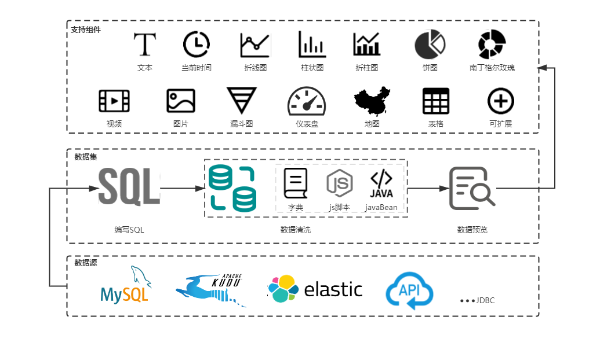


### 报表设计

下面聊一下如何设计。

也就是以上三步，我们就直接来设计页面看一下。

#### 配置数据源（连接数据库）

1. 步骤

   点击菜单栏数据源 -> 新增 -> 项目基础配置,然后进行简单配置即可

   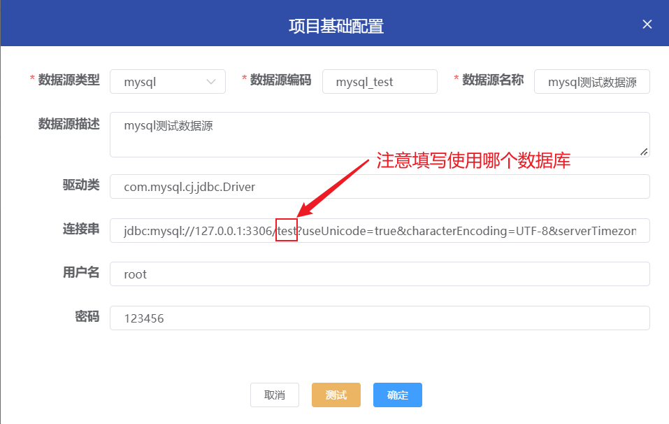

   - 驱动类、连接串、用户名、密码必须填写正确。
   - 只有测试通过的数据源才可以保存。

#### 配置数据集（查表）

1. 步骤

   点击菜单栏数据集 -> 新增 -> 编辑数据集，填写数据源，数据集编码及名称，sql语句即可。

   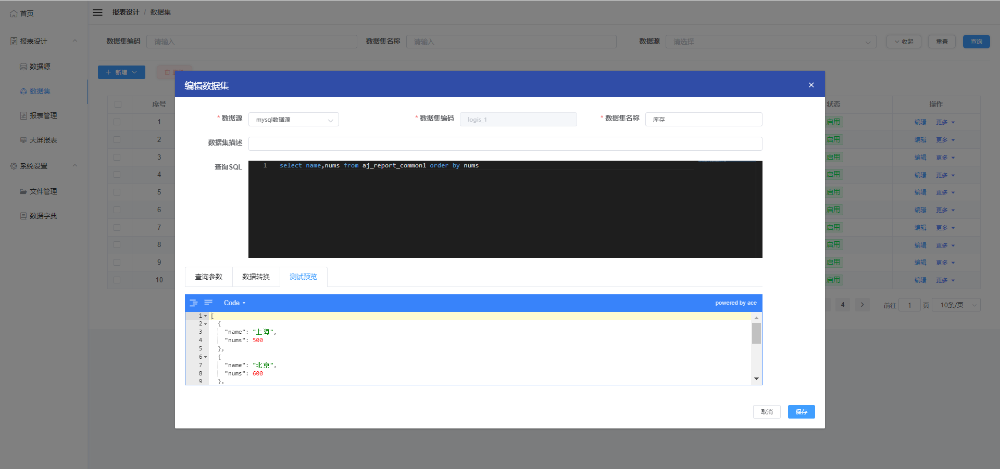

2. 注意

   SQL数据集尽量不要使用 “select *”，以及展示很大的数据量，图表不一定能展示、页面可能会卡死

3. 功能栏

   - 查询参数(扩展)
   - 数据转换(扩展)
   - 测试预览


#### 配置大屏或报表（渲染展示）

 1.  添加报表

     点击报表管理数据 -> 新增 -> 报表管理，填写报表名称、编码、类型。

     注意报表编码唯一。
     
     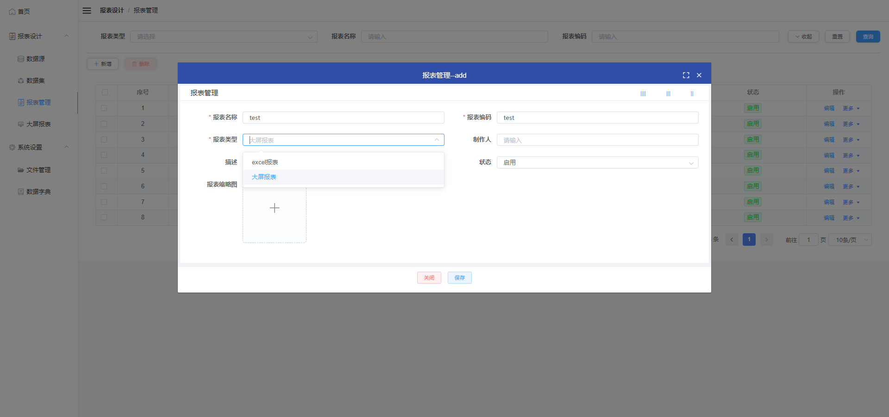

   2. 设计大屏（进入设计大屏）

   		进入设计大屏其一：报表管理 -> 列表操作栏 -> 更多 -> 设计可进入；其二：大屏报表 -> 列表 ->  设计图标可进入。
   	
   	   设计空白页如下图有工具栏、图层、保存和配置栏等。 
   	
   	   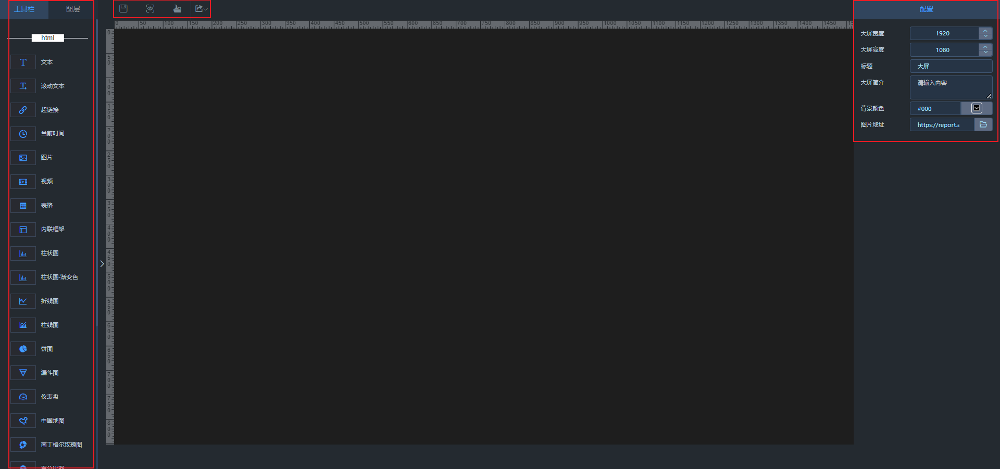
   	   
   	  点击工具栏组件拖到中间设计屏幕，鼠标选中组件可以看到右边有具体组件的配置，数据绑定及位置坐标设置，进行具体设置即可。
   	 

  3. 保存、预览、分享
     
     点击预览即可进入大屏展示界面。

     这个分享还是有点意思的，像百度网盘一样分享需要密码才能打开。

     具体如图。

     操作 - > 更多 -> 分享
     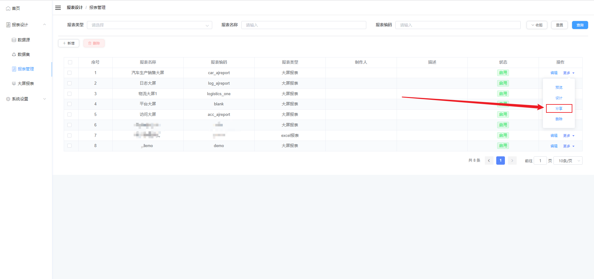
     
     然后跳转到如下界面
     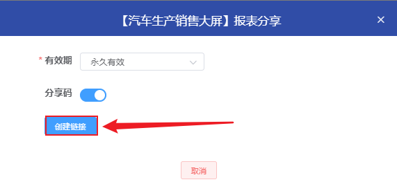
     
     点击创建链接
     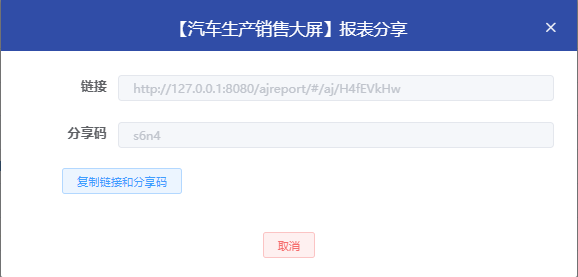

     复制链接和分享码到浏览器打开时候就需要输入密码了。
     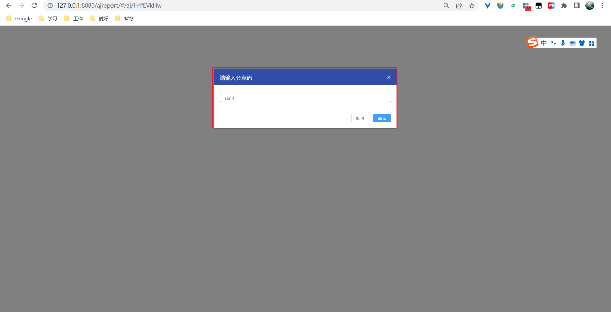

     输入密码确认即可进入大屏了。

### 系统设置

#### 文件管理

支持多种文件上传，如图片、pdf、视频等。

#### 数据字典

系统设置 -> 数据字典 -> 新增 -> 填写配置

字典列表操作 -> 更多 -> 编辑字典项

### 扩展

数据库伪数据

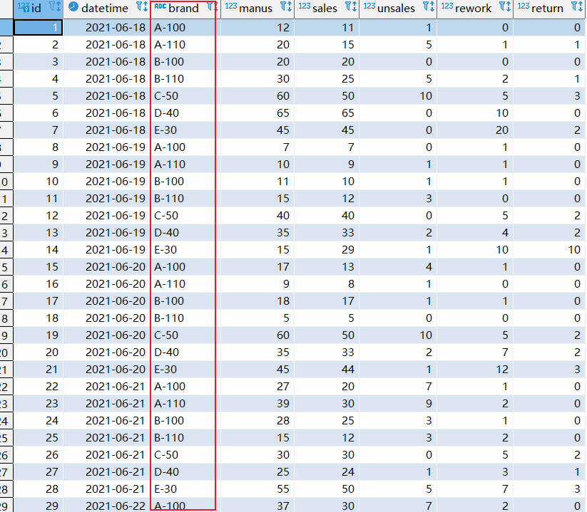


#### 查询参数

> 查询参数主要是针对 sql 中存在的动态参数，需要在后续的大屏使用时动态传入的时候做的操作。http 类型数据源支持改请求路径。请求头，请求体内容。

如图所示，查询 sql 中，定义了两个变量，startTime 和 endTime。那需要我们在查询参数中添加对应的两个参数。 参数名保持和查询 sql 中 ${param} 保持一致。

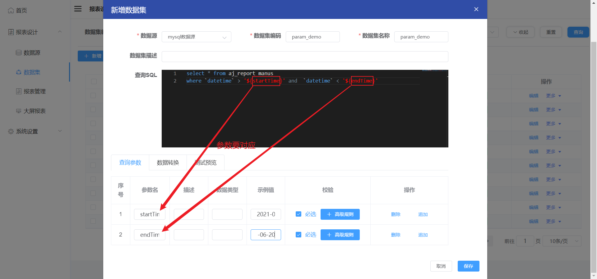


测试预览：（展示的数据就只有startTime 和 endTime这段时间的数据了）

```
[
  {
    "datetime": "2021-06-19",
    "unsales": 0,
    "manus": 7,
    "id": 8,
    "rework": 1,
    "brand": "A-100",
    "sales": 7,
    "return": 0
  },
  ...
  ...
]
```
#### 数据转换

步骤：数据转换 -> 新增 -> (js脚本为例)

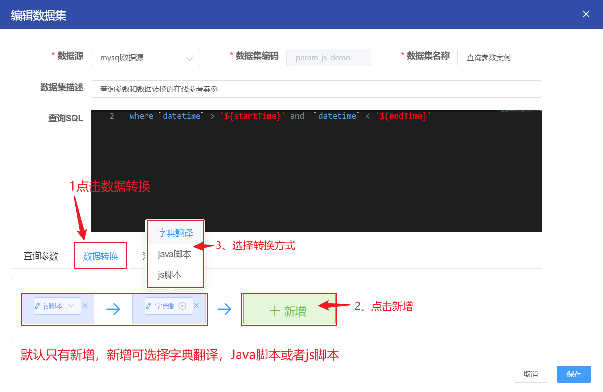


**需求1：实现对brand字段进行拆分,例如 A-100 拆分为 A 和 100**

点击js脚本前小蜡笔图标编辑如下代码

```javascript

   function dataTransform(data){

       //自定义脚本内容

       //1.遍历测试预览中的java.util.ArrayList<java.lang.Object>

       for(j = 0, len = data.length; j < len; j++){

           //获取一行数据

           var row = data[j]

           //比如对brand字段进行拆分,例如A-100，B-50

           var brand = row['brand']

           var split = brand.split('-')

           //新增两个字段

           var model = split[0]

           var series = split[1]

           //对原始对象赋值

           dataj = model

           dataj = series

       }

       return data;

   }

```

数据转换后测试预览

```
  [
     {
       "datetime": "2021-06-19",
       "unsales": 0,
       "manus": 7,
       "series": "100",
       "model": "A",
       "id": 8,
       "rework": 1,
       "brand": "A-100",
       "sales": 7,
       "return": 0
     }
   ] 
```

   字典翻译(数据转换的一种，应该是官方封装好的脚本)

**需求2："model": "A",转换为"model": "A模型",**

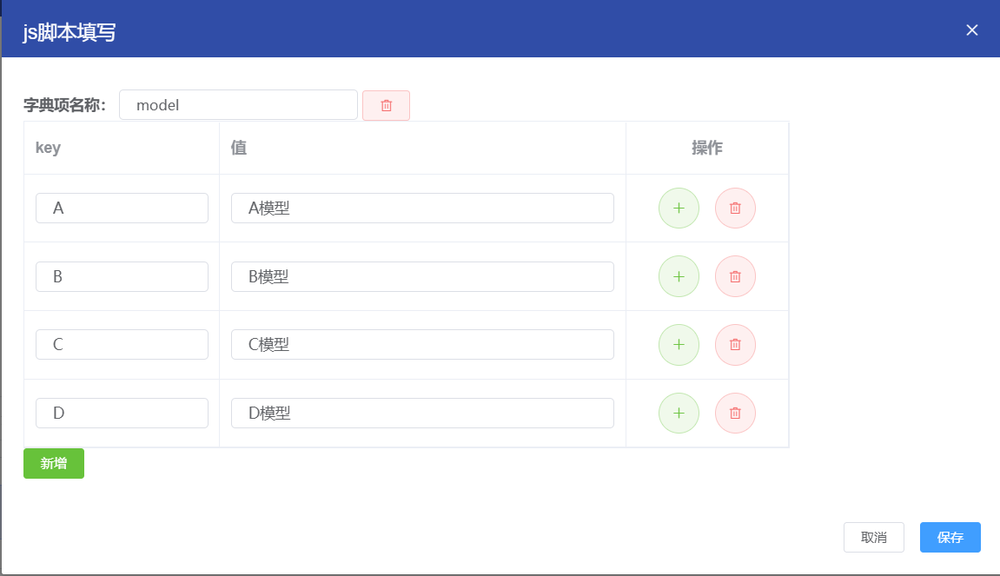


数据转换+字典翻译后测试预览

```
[
  {
     "datetime": "2021-06-19",
     "unsales": 0,
     "manus": 7,
     "series": "100",
     "model": "A模型",
     "id": 8,
     "rework": 1,
     "brand": "A-100",
     "sales": 7,
     "return": 0
   }
] 
```

### 后记
以上就是我关于此次分享全部内容。

当然因为水平和时间有限，如有不足之处，欢迎之后交流指正。

最后感谢各位的聆听。