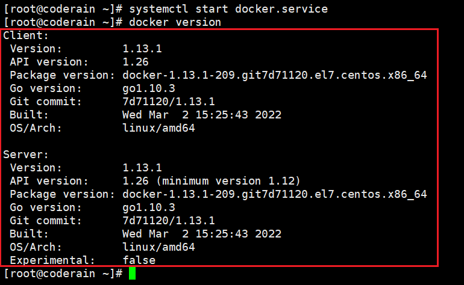

1、安装

```
yum install -y docker
```

2、开启Docker服务

```
systemctl start docker.service
```

3、查看安装版本
```
docker version
```




4、设置开机启动
```
systemctl enable docker.service
```

5、配置DOCKER镜像下载加速
默认安装后的Docker 环境在拉取Docker 镜像时速度较慢


直接编辑配置⽂件：
```
vim /etc/docker/daemon.json
```
在其中加⼊加速镜像源地址(如网易)即可：
```
{
"registry-mirrors": ["http://hub-mirror.c.163.com"]
}
```


配置完加速地址后，重新加载配置⽂件
```
systemctl daemon-reload
```
重启docker 服务即可
```
systemctl restart docker.service
```

6、常见国内镜像源

```
Docker中国官方镜像加速
--registry-mirror=https://registry.docker-cn.com
 
网易163镜像加速
--registry-mirror=http://hub-mirror.c.163.com
 
中科大镜像加速
--registry-mirror=https://docker.mirrors.ustc.edu.cn
 
阿里云镜像加速（需要注册账号后使用）
--registry-mirror=https://{your_id}.mirror.aliyuncs.com
 
daocloud镜像加速（需要注册账号后使用）
--registry-mirror=http://{your_id}.m.daocloud.io
```
