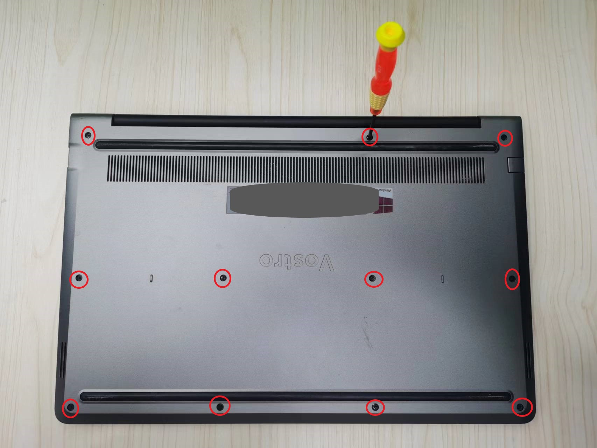
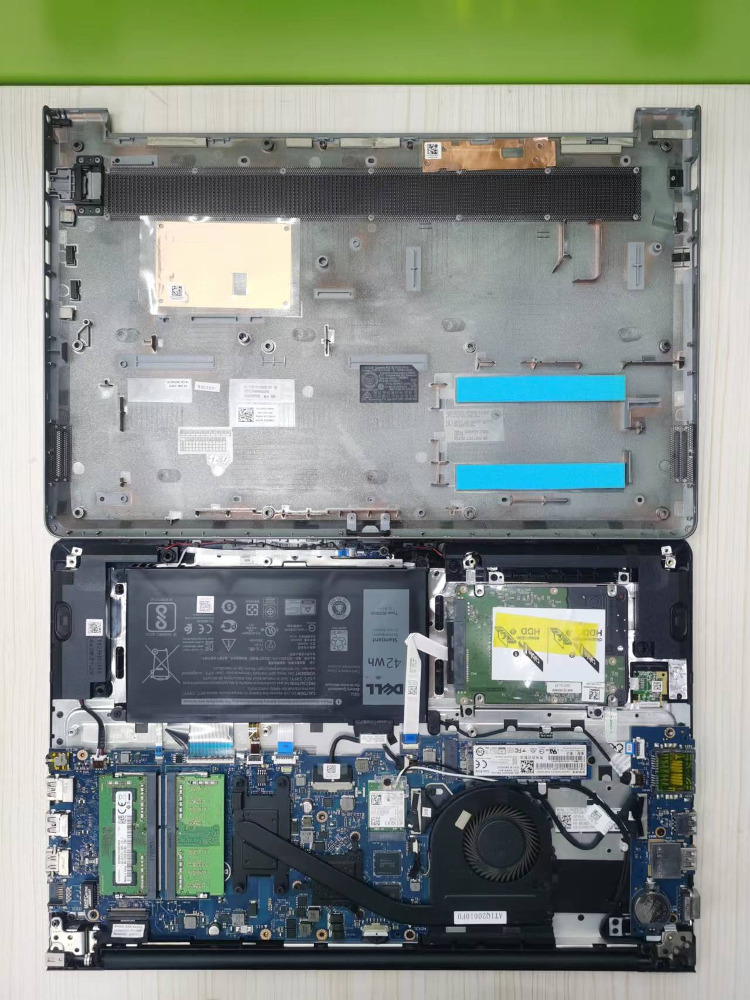
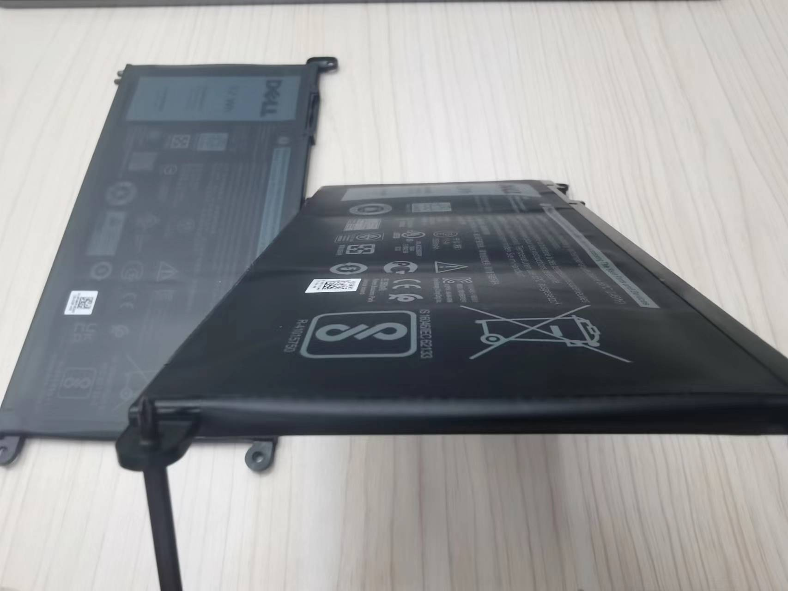
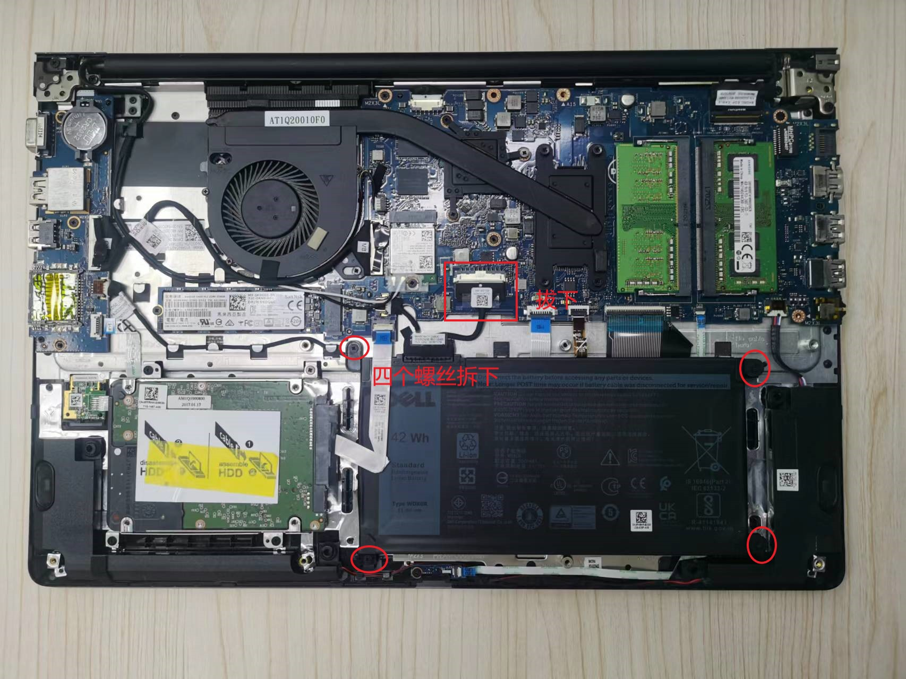
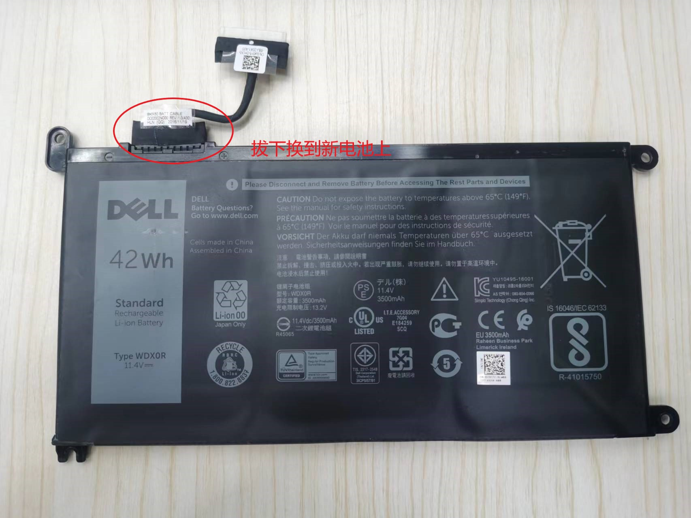

## 前期准备

拆机工具：小型的十字螺丝刀（购买电池时可以考虑咨询店家是否附赠）

新电池： **注意购买前注意查看自己电脑型号**

如何查看电脑型号？

方法一，在搜索栏里输入dxdiag，点击确定，页面中所显示的系统型号即为电脑型号。

方法二，使用快捷键Windows+R，在搜索栏输入cmd，点击确定，直接在页面输入`systeminfo`回车即可出现系统型号。

## 更换步骤

关机，拔掉所有外部设备（使用无线鼠的注意无线鼠标接收器）将笔记本翻过来。

开始拆卸后盖，拧松固定螺丝，**注意有的螺丝拧松就好**，是拧不出来的。

然后用卡片，将后盖咬合的卡扣划开，然后揭开后盖，**注意不要生掰**。

拆开后效果

可以看到自己的电池明显鼓包。对比新买电池如下图可以看出老电池用的多暴力了。目前老电池残余电量拔掉电源电脑三秒钟必定关机。

拆出旧电池，首先断开电池与电脑主板的连接，将电池上的连接线从主要上连接槽拔出，拆卸螺丝，取下电池。

连接线换到新电池上并装回电脑指定位置。此处有坑，下文细讲。尽量连接电池前按住电源键放电几秒钟。

然后复原即可插上电源开机查看电池情况。
[查看电池情况](https://www.cnblogs.com/Code-Rain/p/15916422.html)

## 踩坑

换电池后无法开机，插上电源显示灯正常亮。

查阅网上方案类似现象

现象：按下电源开关键之后电源灯都不亮，但是充电指示灯亮着。

原因：主板不通电。

方案：释放静电尝试，去除电脑的电池和电源线，确保笔记本处于完全不通电状态，重复按电源开关几次，每次持续按住10秒，接上电源尝试开机，然后能正常开机了。
