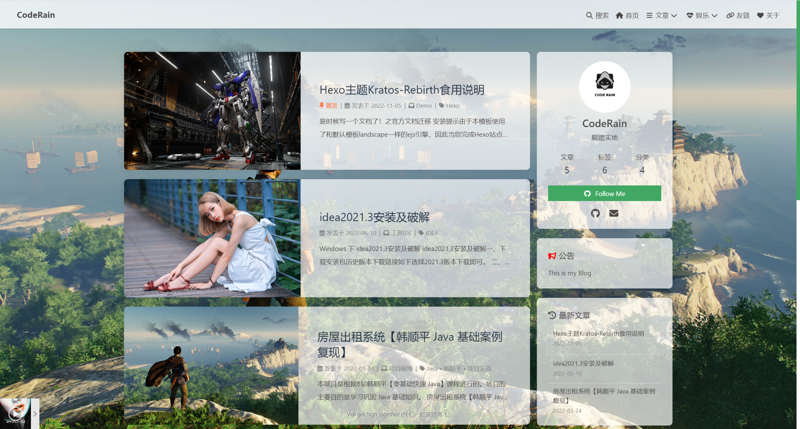

### 效果



### 新建css文件

引入css改变页面的样式，推荐在一个自己新建目录创建。有人选择在主题文件夹下找到css文件夹（\themes\Butterfly\source\css），这样系统升级可能会把自己的代码覆盖掉。本人是在`Blog\CodeRain\source\css`新建一个transpancy.css文件（文件名可以自取），修改最右边的数字改变透明度。

目录截图：


`transpancy.css文件`

```css 
/* 文章页背景 */
.layout_post>#post {
    /* 以下代表透明度为0.7 可以自行修改*/
    background: rgba(255,255,255,.7);
}

/* 所有页面背景 */
#aside_content .card-widget, #recent-posts>.recent-post-item, .layout_page>div:first-child:not(.recent-posts), .layout_post>#page, .layout_post>#post, .read-mode .layout_post>#post{
    /* 以下代表透明度为0.7 */
    background: rgba(255,255,255,.7);
}
/*侧边卡片的透明度 */
:root {
  --card-bg: rgba(255, 255, 255, .7);
}
/* 页脚透明 */
#footer {
	/* 以下代表透明度为0.7 */
	background: rgba(255,255,255, .0);
}

```

### 引入css 文件

在主题配置文件_config.yml引入css文件,全局检索inject,在以下head位置插入字段

位置图片：


```
<link rel="stylesheet" href="/css/transpancy.css">
```

### 排查过程（页脚为例）

浏览器页面打开


浏览器调试


去主题下面css文件夹下修改文件，此外发现仍有阴影，记得去（我本地设置）_config.butterfly.yml配置文件中将`footer_bg: false`


如上目录下把这个背景色注释掉发现问题解决（粗暴有侵入，所以另外引入CSS）
