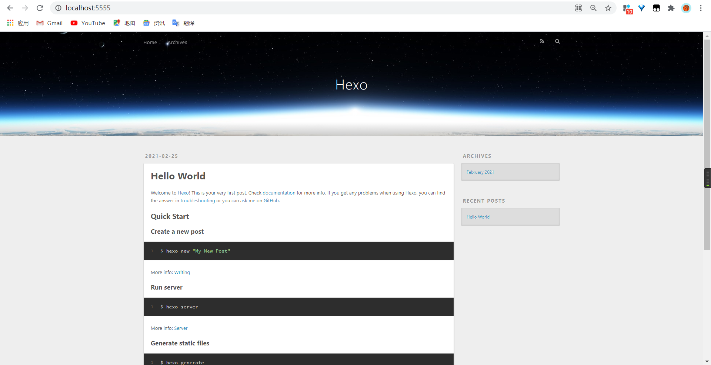

# Hexo+Github免费搭建博客教程

## 下载安装node.js

在[node.js官网](https://nodejs.org/zh-cn/)下载安装包安装即可。


Win键+R输入cmd进入命令窗口输入node  -v(注意-v前有个空格)，如图若出现node版本信息，则安装成功。


## 注册GitHub

在[github官网](https://github.com/)注册登录即可


### 创建第一个github仓库

如图：1创建>2命名>3勾选>4create即可


**待完善**

**待完善**

---


## 安装git

在[git for windows](https://gitforwindows.org/)下载安装即可


##四、GitHub的ssh配置

打开git bash，输入如下命令

```dos
ssh-keygen -t rsa -C "your_email@youremail.com" 
```


如图执行这条命令，会产生下图两个文件


打开GitHub，新建ssh key


打开.ssh目录下的id_rsa.pub文件，复制里面的内容，到github如下所示SSH key的信息，添加即可。


## hexo的使用

新建Blog文件夹(自己任意设置)，装载hexo到E盘Blog文件夹下


```dos
C:\Users\Li>E:      //切换到E盘，自行选择装在盘符地址

E:\>cd Blog			//切换到Blog			

E:\Blog>npm install hexo-cli -g   //下载hexo命令

$ hexo init CodedogWorld
```

安装成功如图


执行以下代码

```dos
E:\Blog>cd CodedogWorld

E:\Blog\CodedogWorld>npm install    //安装依赖

E:\Blog\CodedogWorld>hexo s -p 5555    
```

结果如图


浏览器输入http://localhost:5555/出现如下图，则搭建成功。




ps:

[hexo官网](https://hexo.io/zh-cn/docs/)，官网文档有安装步骤。

[参考视频]()

[参考博客](https://www.cnblogs.com/zjfjava/p/10080569.html)

## 代码编辑器安装及修改博客内容

**待补充**

**待补充**

---


配置   [相关文档](https://hexo.io/docs/one-command-deployment)

```xml
type: git                //注意git前空格 
repo：https://github.com/CodedogWorld/CodedogWorld.github.io.git
```


## hexo发布到github

```dos
E:\Blog\CodedogWorld>hexo g
```


报错

```dos
E:\Blog\CodedogWorld>hexo d
INFO  Validating config
ERROR Deployer not found: git
```

修复问题(下端口)

[Git文档](https://hexo.io/docs/one-command-deployment)

```dos
npm install hexo-deployer-git --save

E:\Blog\CodedogWorld>hexo g     //生成静态文件

E:\Blog\CodedogWorld>hexo d    //文件生成后立即部署网站
```

成功运行


## next主题使用

[next使用教程](http://theme-next.iissnan.com/getting-started.html)

**为NexT主题添加文章阅读量统计功能**

标签分类关于页面创建

```bash
hexo n page tags    #标签页面创建
hexo n page categories     #分类页面创建
hexo n page about       #关于页面创建
```

然后分别在各自md文件中加入

```md
type: "tags"
type: "categories"
```


## 博客创建

命令行输入如下命令

```node
hexo new "markdown语法"
```


删除已经创建或者创建错误的博客

1. 到目录/source/_posts下删除相应的文章
2. $ hexo g
3. $ hexo d

## hexo问题

**问题1：**

> Accessing non-existent property 'column' of module exports inside circular dependency

```hexo
(node:22132) Warning: Accessing non-existent property 'lineno' of module exports inside circular dependency
(Use `node --trace-warnings ...` to show where the warning was created)
(node:22132) Warning: Accessing non-existent property 'column' of module exports inside circular dependency
(node:22132) Warning: Accessing non-existent property 'filename' of module exports inside circular dependency
(node:22132) Warning: Accessing non-existent property 'lineno' of module exports inside circular dependency
(node:22132) Warning: Accessing non-existent property 'column' of module exports inside circular dependency
(node:22132) Warning: Accessing non-existent property 'filename' of module exports inside circular dependency
```

**方案**:


**问题2：**

```dos
WARN  Since language_switcher is turned on, the caching is disabled to avoid potential hazards.
```


**问题3**：

```dos
 err: Error: Spawn failed
      at ChildProcess.<anonymous> (E:\Blog\CodedogWorld\node_modules\hexo-util\lib\spawn.js:51:21)
      at ChildProcess.emit (events.js:315:20)
      at ChildProcess.cp.emit (E:\Blog\CodedogWorld\node_modules\cross-spawn\lib\enoent.js:34:29)
      at Process.ChildProcess._handle.onexit (internal/child_process.js:277:12) {
    code: 128
```

**原因**:

> 因为`git`进行`push`或者`hexo d`的时候改变了一些`.deploy_git`文件下的内容

**方案**:

>  1. 删除`.deploy_git`文件夹;
>  2. 输入`git config --global core.autocrlf false`
>  3. 然后，依次执行：
>     `hexo clean`
>     `hexo g`
>     `hexo d`
>


**问题4**


原因：谷歌搜索引擎问题

解决方案：

设置>管理搜索引擎>更换百度搜索引擎


[换电脑后怎么迁移hexo博客？](https://blog.csdn.net/qq_36667170/article/details/118163563)