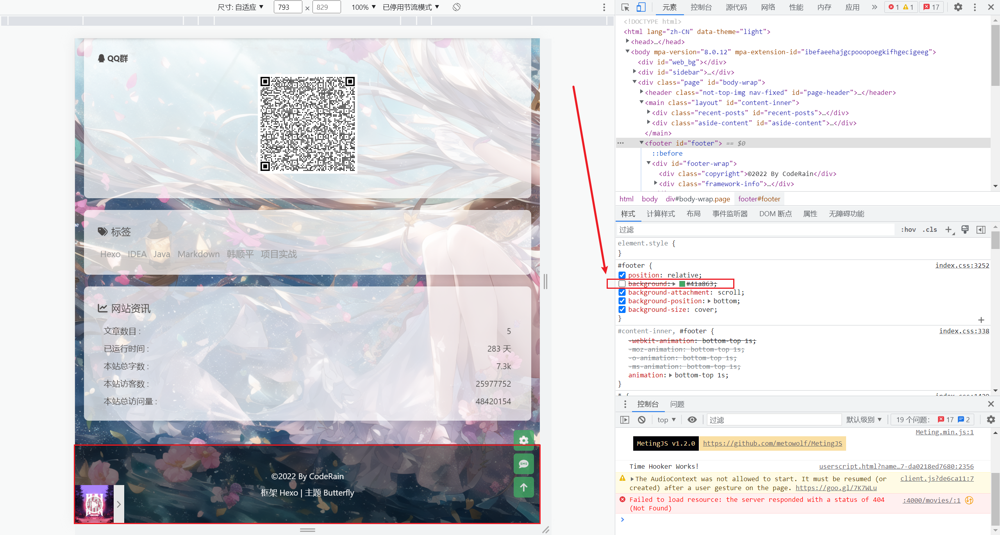
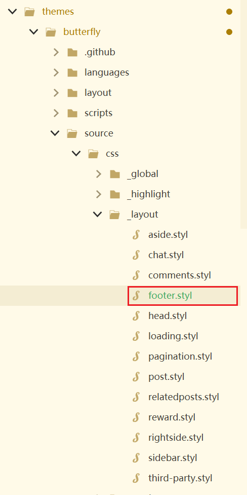

# Hexo主题Butterfly配置、踩坑及魔改

## Butterfly配置

### 参考文档

已经特别详细了：https://butterfly.js.org/posts/21cfbf15/

### 引入字数统计

1. 引入字数统计相关插件：

```
npm install hexo-wordcount --save
```

2. 修改主题配置文件_config.butterfly.yml

```
wordcount:
  enable: true
  post_wordcount: true
  min2read: true
  total_wordcount: true
```

## 踩坑

### 问题1

改导航菜单一定要hexo clean
然后再重新hexo g
否则可能会报错

```
FATAL YAMLException: bad indentation of a mapping entry at line 26, column 7:
        读书: /books/ || fas fa-book

......
......

  message: 'bad indentation of a mapping entry at line 26, column 7:\n' +
    '        读书: /books/ || fas fa-book\n' +
```


### 问题2

#### 问题

Hexo主题Butterfly启动后报错

```
extends includes/layout.pug block content include ./includes/mixins/post-ui
.pug #recent-posts.recent-posts +postUI include includes/pagination.pug
```

#### 场景

更换新主题Butterfly

#### 原因

没有 pug 以及 stylus 的渲染器

#### 解决方案

```
npm install hexo-renderer-pug hexo-renderer-stylus --save
npm install hexo-deployer-git --save / yarn add hexo-deployer-git
```
再次依次执行

```
hexo clean
hexo g
hexo s -p 4000
```

### 问题3

#### 问题

Valine、Waline评论失效，评论失败，翻墙可以评论成功。

#### 场景

Hexo主题Butterfly添加评论功能

#### 原因

由于 Valine 的国际版共享域名将于 2022 年 8 月 1 日起不再向中国大陆的最终用户提供服务，国际版共享域名仅服务于海外用户。

#### 解决方案

[关于waline国内无法使用的解决方案 （vercel.app国内无法使用问题）](https://blog.csdn.net/Panzer_Jack/article/details/127418379?spm=1001.2101.3001.6650.13&utm_medium=distribute.pc_relevant.none-task-blog-2%7Edefault%7EOPENSEARCH%7ERate-13-127418379-blog-127204331.pc_relevant_recovery_v2&depth_1-utm_source=distribute.pc_relevant.none-task-blog-2%7Edefault%7EOPENSEARCH%7ERate-13-127418379-blog-127204331.pc_relevant_recovery_v2&utm_relevant_index=14)

博客更换为Waline评论系统

https://blog.csdn.net/hubojing/article/details/122659549

## 魔改

### 嵌入豆瓣插件展示豆瓣图书电影

#### 安装

```
npm install hexo-douban --save
```

#### 配置

在博客站点的配置文件 _config.yml 中添加以下内容（注意：不是主题的配置文件）
```
# 豆瓣 
douban:
  id: 191537030
  book:
    path: books/index.html
    title: 'CodeRain 的书架'
    quote: ''
  movie:
    path: movies/index.html
    title: '刻骨铭心的电影'
    quote: '她'
  timeout: 10000 
```

- user: 你的豆瓣ID(纯数字格式，不是自定义的域名)。获取方法可以参考怎样获取豆瓣的数字 ID ？
- path: 生成页面后的路径，默认生成在 //yourblog/books/index.html 等下面。如需自定义路径，则可以修改这里。
- title: 该页面的标题。
- quote: 写在页面开头的一段话,支持html语法。
- timeout: 爬取数据的超时时间，默认是 10000ms ,如果在使用时发现报了超时的错(ETIMEOUT)可以把这个数据设置的大一点。
如果只想显示某一个页面(比如movie)，那就把其他的配置项注释掉即可。

#### 主题兼容

对于使用 hexo-theme-butterfly 等使用 pjax 进行渲染的主题，需要在 _config.yml 中将豆瓣页进行排除，否则 js 会失效导致页面异常 @ISSUE 108 :
```
pjax:
  enable: true
  exclude:
    - /movies/
    - /books/
    - /games/
```

#### 菜单

如果上面的显示没有问题就可以在主题的配置文件 _config.yml 里添加如下配置来为这些页面添加菜单链接.
```
menu:
  Home: /
  Archives: /archives
  Books: /books     #This is your books page
  Movies: /movies   #This is your movies page
  Games: /games   #This is your games page
```
注意这些页面不需要new创建 
而是使用`hexo douban -bmg`创建

#### 使用

```
$ hexo douban -h
Usage: hexo douban

Description:
Generate pages from douban

Options:
  -b, --books   Generate douban books only
  -g, --games   Generate douban games only
  -m, --movies  Generate douban movies only
如果不加参数，那么默认参数为-bgm。
```
需要注意的是，通常大家都喜欢用hexo d来作为hexo deploy命令的简化，但是当安装了hexo douban之后，就不能用hexo d了，因为hexo douban跟hexo deploy的前缀都是hexo d。


官方指导文档：https://github.com/mythsman/hexo-douban

#### 效果

执行`hexo douban -bm`


### hexo butterfly主题设置背景透明度和字体

#### 效果


#### 新建css文件

引入css改变页面的样式，推荐在一个自己新建目录创建。有人选择在主题文件夹下找到css文件夹（\themes\Butterfly\source\css），这样系统升级可能会把自己的代码覆盖掉。本人是在`Blog\CodeRain\source\css`新建一个transpancy.css文件（文件名可以自取），修改最右边的数字改变透明度。

目录截图：


`transpancy.css文件`

```css 
/* 文章页背景 */
.layout_post>#post {
    /* 以下代表透明度为0.7 可以自行修改*/
    background: rgba(255,255,255,.7);
}

/* 所有页面背景 */
#aside_content .card-widget, #recent-posts>.recent-post-item, .layout_page>div:first-child:not(.recent-posts), .layout_post>#page, .layout_post>#post, .read-mode .layout_post>#post{
    /* 以下代表透明度为0.7 */
    background: rgba(255,255,255,.7);
}
/*侧边卡片的透明度 */
:root {
  --card-bg: rgba(255, 255, 255, .7);
}
/* 页脚透明 */
#footer {
	/* 以下代表透明度为0.7 */
	background: rgba(255,255,255, .0);
}

```

#### 引入css 文件

在主题配置文件_config.yml引入css文件,全局检索inject,在以下head位置插入字段

位置图片：


```
<link rel="stylesheet" href="/css/transpancy.css">
```

#### 排查过程（页脚为例）

浏览器页面打开


浏览器调试


去主题下面css文件夹下修改文件，此外发现仍有阴影，记得去（我本地设置）_config.butterfly.yml配置文件中将`footer_bg: false`


如上目录下把这个背景色注释掉发现问题解决（粗暴有侵入，所以另外引入CSS）


