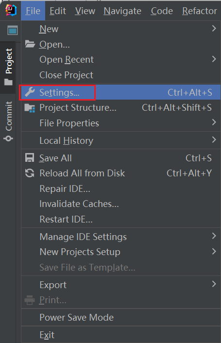
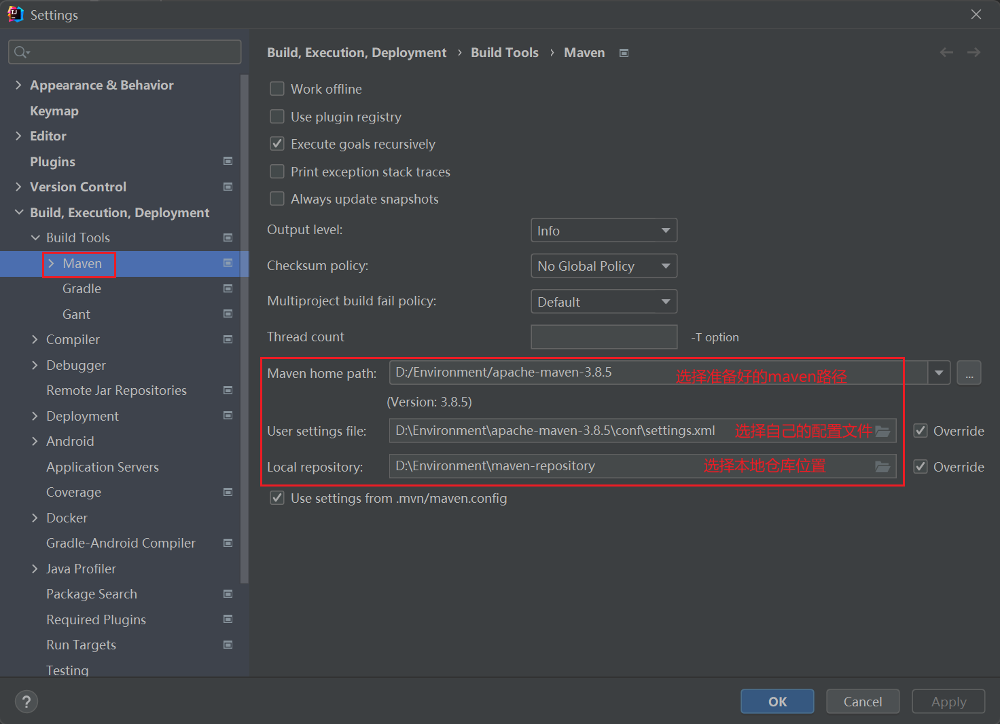
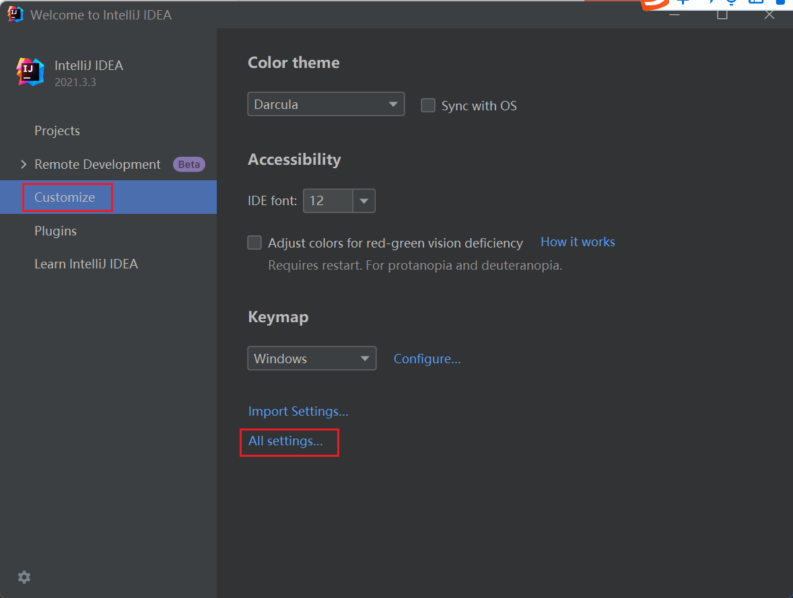
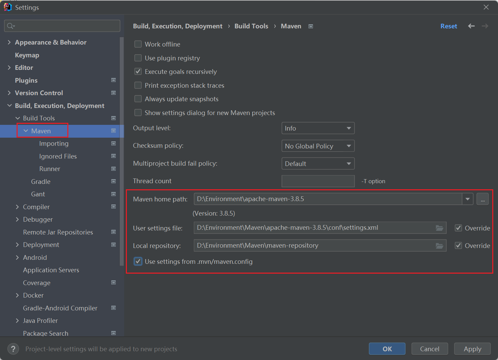

0、需求

maven用来管理依赖，是专门用于构建和管理项目的工具，很大程度方便了我们对依赖导包等，然而Idea配置自己本地maven很有必要

1、准备

idea2021.3.3
maven 对应版本

2、步骤

首先打开File ==> Setting

然后 Build ==> Build Tools ==> Maven，如下图选择对应的路径及配置应用确认即可。

注意的是：idea使用的JDK版本要和第二步试运行maven时显示的JDK版本一致。

3、扩展

全局设置maven配置（如果平时项目所用版本一致，可以考虑设置）

Idea启动页面找到设置

找到maven设置即可进行全局设置。

此外maven helper插件是个宝藏插件，可以考虑下载使用解决依赖冲突。