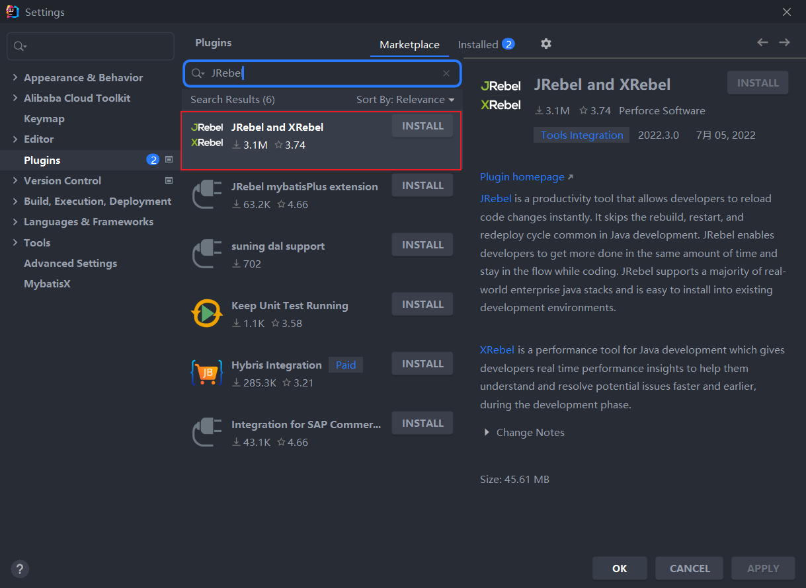
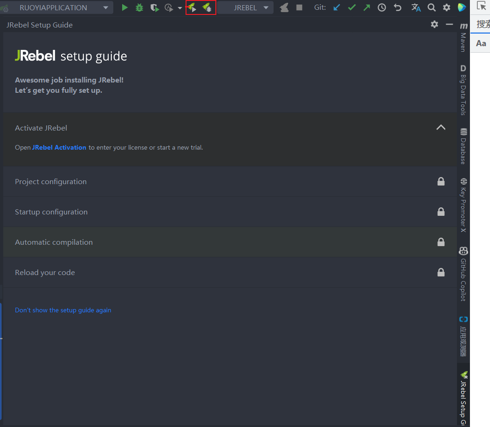
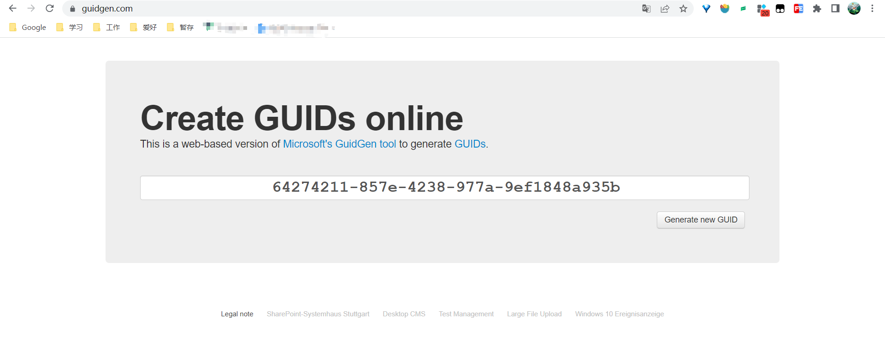
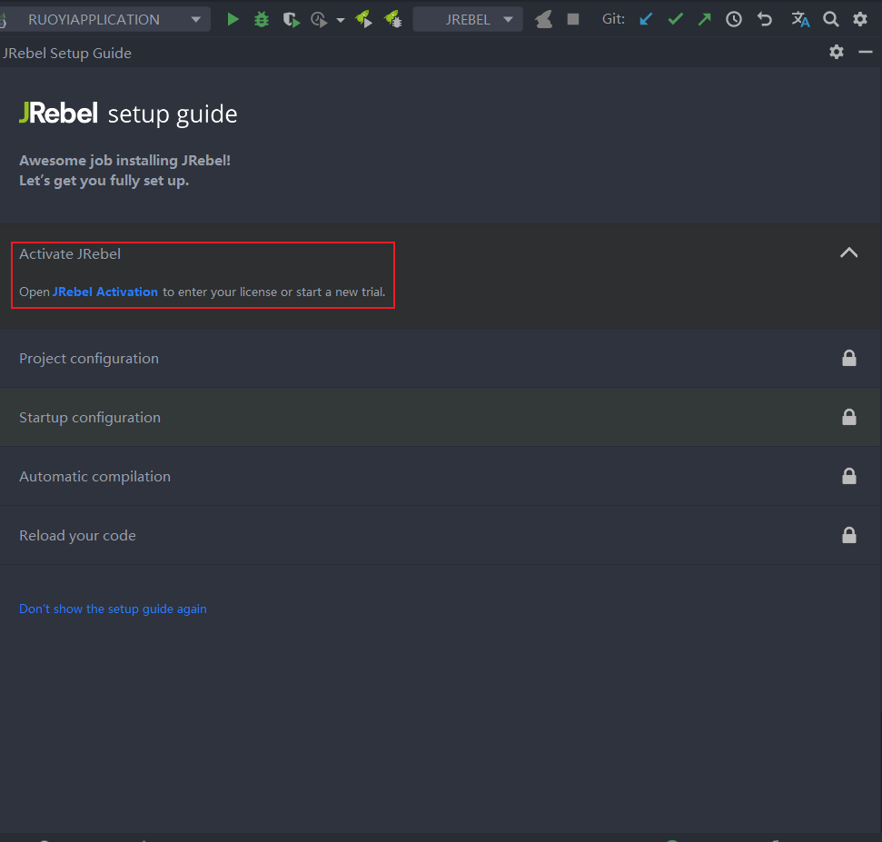
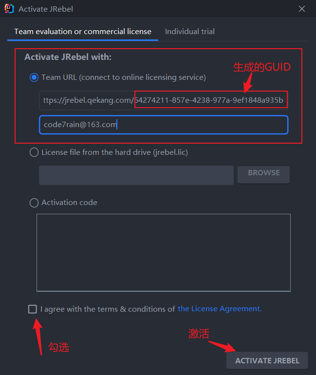
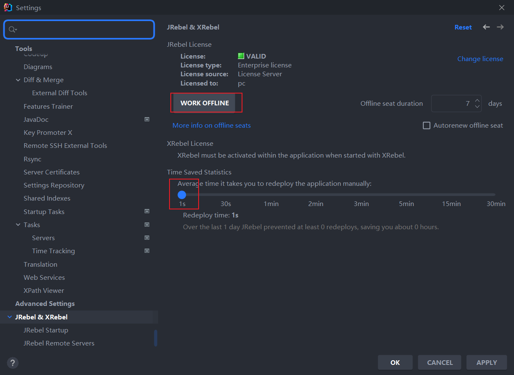

1、背景

一般更新了 Java 文件后要手动重启整个项目，才能生效，这很影响开发速度，于是热部署就出现了。

热部署就是正在运行状态的应用，修改了他的源码之后，在不重新启动的情况下能够把修改内容编译并部署到服务器上，使得修改立即生效。

使用JRebel后，可以不用重启便可将修改的代码有效，非常的高效。

2、下载安装

Idea下安装JRebel插件

File -> Settings -> Plugins 中搜索JRebel,安装插件,

下载完成后重启Idea，来到引导页面

**3、激活（由于是付费软件，所以这里需要激活）**

激活前需要准备：GUID + 邮箱

这里给出一个在线生成GUID地址： https://www.guidgen.com/

如图界面拿到生成的一个 GUID ，并且准备好自己的邮箱（虚假邮箱也可，不校验），然后即可进入激活页面激活。

点击 Jrabel Activation 进入激活

地址格式是https://jrebel.qekang.com/GUID，其中的GUID是上述给出地址生成的

点击激活完成后跳转到jrebel快速开始官网

到此激活成功。

4、其他配置

File -> Settings -> Jrebel&Xrebel 设置 Jrebel 离线工作，并且部署时间设置为1s

[参考文章](https://www.cnblogs.com/shan333/p/16098637.html)

[参考文章](https://blog.csdn.net/qq_16148137/article/details/99694566?spm=1001.2101.3001.6650.5&utm_medium=distribute.pc_relevant.none-task-blog-2%7Edefault%7ECTRLIST%7Edefault-5-99694566-blog-116466114.pc_relevant_multi_platform_whitelistv1_exp2&depth_1-utm_source=distribute.pc_relevant.none-task-blog-2%7Edefault%7ECTRLIST%7Edefault-5-99694566-blog-116466114.pc_relevant_multi_platform_whitelistv1_exp2&utm_relevant_index=9)

[参考文章](https://www.cnblogs.com/fantyovo/p/15682345.html)
