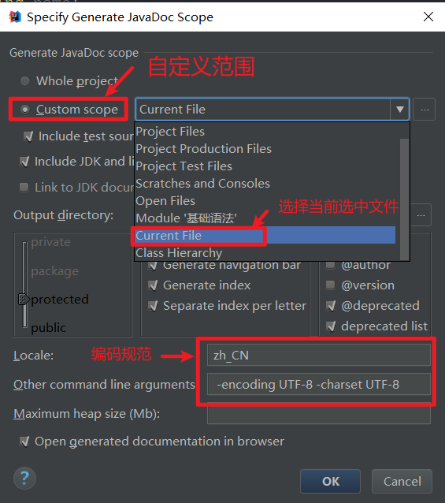

# Java基础语法

## 前言

### JDK JRE JVM

- JDK: java development kit java 环境
- JRE: java Runtime Environment java 运行时环境
- JVM: java virtual Machine java 虚拟机

### Java 运行机制

- 编译型
  - 所有的Java代码都是要编译的，.java不经过编译就什么用都没有。
- 解释型
  - java代码编译后不能直接运行，它是解释运行在JVM上的，所以它是解释运行的，那也就算是解释的了。

### HelloWorld

```java
public class HelloWorld {
    public static void main(String[] args) {
        String $firstname = "L";
        String _lastname = "Q";
        String age = "1";

        System.out.println("Hello World"+ " "+ $firstname + _lastname + " "+ age );
    }

}
```

> 可能遇到的问题


## 01、注释

1. 单行注释(idea快捷键ctrl+/)
2. 多行注释(idea快捷键ctrl+shift+/)
3. 文档注释

```java
/**
 * Created by Q on 2021/4/17.
 */

public class HelloWorld {
    public static void main(String[] args) {
//单行注释输出hello world
        System.out.println("Hello World");
    }

/*多行注释
多行注释*/

/**
 * @author Q
 * @decription JavaDoc文档注释
 */
}
```

## 02、标识符与关键字

### 2-1 标识符

Java 中标识符是为方法、变量或其他用户定义项所定义的名称。标识符可以有一个或多个字符。在 Java 语言中，标识符的构成规则如下。

>标识符由数字（0~9）和字母（A~Z 和 a~z）、美元符号（$）、下划线（_）以及 Unicode 字符集中符号大于 0xC0 的所有符号组合构成（各符号之间没有空格）。
>
>标识符的第一个符号为字母、下划线和美元符号，后面可以是任何字母、数字、美元符号或下划线。


另外，Java 区分大小写，因此 name 和 Name 是两个不同的标识符。

注意：标识符命名时，切记不能以数字开头，也不能使用任何 Java 关键字作为标识符，而且不能赋予标识符任何标准的方法名。

标识符分为两类，分别为关键字和用户自定义标识符。

>关键字是有特殊含义的标识符，如 true、false 表示逻辑的真假。
>
>用户自定义标识符是由用户按标识符构成规则生成的非保留字的标识符，如 abc 就是一个标识符。注意：使用标识符时一定要注意，或者使用关键字，或者使用自定义的非关键字标识符。此外，标识符可以包含关键字，但不能与关键字重名。

合法与不合法标识符示例。

	合法标识符：date、$2021、_date、D_$date 等。
	
	不合法的标识符：1111.com、1com、for、if 等。


标识符用来命名常量、变量、类和类的对象等。因此，在我们命名标识符时，应赋予它一个有意义或有用途的名字。

### 2-2 关键字

关键字（或者保留字）是对编译器有特殊意义的固定单词，不能在程序中做其他目的使用。关键字具有专门的意义和用途，和自定义的标识符不同，不能当作一般的标识符来使用。

Java 的关键字对 Java 编译器有特殊的意义，它们用来表示一种数据类型，或者表示程序的结构等。

保留字是为 Java 预留的关键字，它们虽然现在没有作为关键字，但在以后的升级版本中有可能作为关键字。

Java 语言目前定义了 51 个关键字，这些关键字不能作为变量名、类名和方法名来使用。以下对这些关键字进行了分类。

>数据类型：boolean、int、long、short、byte、float、double、char、class、interface。
>
>流程控制：if、else、do、while、for、switch、case、default、break、continue、return、try、catch、finally。
>
>修饰符：public、protected、private、final、void、static、strict、abstract、transient、synchronized、volatile、native。
>
>动作：package、import、throw、throws、extends、implements、this、supper、instanceof、new。
>
>保留字：true、false、null、goto、const。


注意：由于 Java 区分大小写，因此 public 是关键字，而 Public 则不是关键字。但是为了程序的清晰及可读性，要尽量避免使用关键字的其他形式来命名。

## 03、数据类型

- 强类型语言：Java  c++ (先定义后使用)
- 弱类型语言：javascript python

java数据类型

### 3-1 基本类型（primitive type）

数值类型+布尔类型

- 整数 ：int   byte   short   long
- 小数：float   double
- 字符：char
- 布尔型：true  false

`字符串String是类不是关键字`

~~~java
/**
 * Created by Q on 2021/4/18.
 */
public class Demo01 {
    public static void main(String[] args) {
		//八大基本类型

		//整数
        int num1 = 1000000; //最常用  4字节
        byte num2 = 111; //-128--127 1字节
        short num3 = 11111;  //2字节
        long num4 = 1111111L; //long类型要在数字后加L 8字节

		//小数：浮点数
        float num5 = 1.111F; //float类型要在数字后加F 4字节
        double num6 = 3.14159265358979; //8字节

		//字符
        char aaa = 'a'; //注意单引号不是双引号，2个字节
        //String name = "李四";
        //字符串String是类不是关键字

		//布尔型：是非
        boolean flag = true; //1位

        System.out.println(flag);
    }
}
~~~

> 扩展

```java
/**
 * Created by Q on 2022/1/5.
 */
public class Demo02 {
    public static void main(String[] args) {
        //整数拓展 进制  二进制（0b开头）  十进制   八进制（0开头）  十六进制（0x开头）
        int i1 = 0b10;
        int i2 = 010;
        int i3 = 0x10;

        System.out.println(i1);
        System.out.println(i2);
        System.out.println(i3);
        System.out.println("===========================");

        //==================================================
        //浮点数拓展    银行业务表示（钱的计算）
        //BigDecimal   数学工具类（如果需要计算，而且不能让它有误差就使用这个类）
        //最好完全避免使用浮点数进行比较
        //==================================================
        float f = 1.1f;
        double d = 1.1d;
        System.out.println(d == f);    //false
        float f1 = 12544524154441f;
        float f2 = f1 + 1;
        System.out.println(f1 == f2);       //true(精度丢失)
        System.out.println("===========================");

        // 字符扩展
        char c1='a';
        char c2='中';
        //我们通过单引号来表示字符常量
        System.out.println(c1);
        System.out.println((int)c1);
        System.out.println(c2);
        System.out.println((int)c2);
        //强制转换可以把字符转换成数字，所有的字符本质还是数字
        // Unicode 编码表：97=a 65=A  （本质上还是数字）
        // 2字节    65536字符  Excel最长有2的16次方=65536
        //U0000   UFFFF
        char c3='\u0061';
        System.out.println(c3);//a
        //转义字符（转义字符它有特殊的意思）
        // \t    制表符
        // \n    换行
        //  转义字符有非常的多，可以自己去查询一下
        System.out.println("Hello\tWorld");
        System.out.println("Hello\nWorld");
        System.out.println("===============================");
        String sa = new String("Hello World");
        String sb=new String("Hello World");
        System.out.println(sa==sb);    //false    两个对象是不同的
        String sc = "Hello World";
        String sd="Hello World";
        System.out.println(sc==sd);    //true

        //布尔值扩展
        boolean flag=true;
        if (flag==true){}
        if (flag){}  //省略
    }
}
```

### 3-2 引用类型（reference type）

类  接口  数组

### 3-3 类型转换

类型从low———->high次序：

```
低 ------------------------------------> 高
byte,short,char—> int —> long—> float —> double
```

#### 3-3-1 自动类型转换

自动类型转换：容量小的数据类型可以**自动**转换为容量大的数据类型。

#### 3-3-2 强制类型转换

强制类型转换，又被称为造型，用于显式的转换一个数值的类型.

> 隐含强制转换

- 可能的默认类型是int。
- 小数默认是双精度浮点型double，在定义浮点类型时必须在数字下面跟上 F 或者 f。

#### 3-3-3 常见的错误和问题

- 操作比较大的数时，要留意是否溢出，尤其是整数操作时；
- long类型使用大写L不要用小写。

#### 3-3-4 拓展：JDK7扩展

- JDK7新特性: 二进制整数
  JDK7为我们直接提供了二进制整数的类型。
  以0b开头即可。

```
//例如：int a = 0b0101：
```

- JDK7新特性：下划线分隔符

```
//例如：int b = 1_2345_6789;
```

根据特性，我们能够很容易地知道这是1亿2345万6789。

- 注意点：
  1.不能把布尔值进行转换 
  2.不能把对象类型转换为不相干的类型 
  3.在把高容量转换到低容量的时候，强制转换 
  4.转换的时候可能存在内存溢出，或者精度问题！

```java
/**
 * Created by Q on 2022/1/6.
 */
public class Demo03 {
    public static void main(String[] args) {
		//类型转换
        int i = 128;
        byte b = (byte)i; //内存溢出
		//自动类型转换  低-->高
        System.out.println(i); //128
        System.out.println(b); //-128
		//===================================================

        System.out.println((int)23.7); //23  //精度问题
        System.out.println((int)-45.89f); //-45  //精度问题
        System.out.println("============================");
		//===================================================

        char c = 'a';
        int d = c+1;
        System.out.println(d); //98
        System.out.println((char)d); //b
		//===================================================

		//操作比较大的数，注意溢出
		//JDK7新特性，数字之间可以用下划线分割
        int money = 10_0000_0000;
        System.out.println(money); //1000000000(10 亿） 不会输出下划线
        int years = 20;
        int total = money*years;
        System.out.println(total); //-1474836480 ,计算时内存溢出
        System.out.println("============================");
        long total2 = money*years; //-1474836480 默认是int，转换之前已经存在问题
        long total3 = money*((long)years);//先将一个数转换为long
        System.out.println(total2);   //-1474836480
        System.out.println(total3);   //20000000000
    }
}
```

## 04、变量与常量

### 4-1 变量


#### 4-1-1 变量作用域

- 类变量
- 实例变量
- 局部变量

#### 4-1-2 变量的命名规范

- 所有的变量、方法、类名：见名知意
- 类成员变量：首字母小写和驼峰原则（lastName）
- 局部变量：首字母小写和驼峰原则（lastName）
- 常量：大写字母和下划线（MAX_VALUE）
- 类名：首字母大写和驼峰原则(HelloWorld)
- 方法名：首字母小写和驼峰原则

#### 4-1-3 注意点

- 实例变量：从属于对象；可以理解为从属于一个类，如果不自行初始化，就会变成这个类型的默认值。
- 所有的数值类型初始化，一般是0  0.0    u00000
- 布尔值：默认是false
- 除了基本类型，其余的默认值都是null 
- 局部变量是在方法里面的；必须声明和初始化值

### 4-2 常量

- 常量名一般使用大写字符
- final 常量名 = 值;

```java
/**
 * Created by Q on 2022/1/6.
 */
public class Demo04 {
    String name;     // 实例变量
    int age;
    //类变量  static（关键字）从属于类
    static double salary = 2500;   //类变量

    static final double PI = 3.14 ;  //常量
    public static void main(String[] args) {
        int a = 2;   //局部变量
        Demo04 demo04 = new Demo04();

        System.out.println(demo04.name);  //null
        System.out.println(demo04.age);  //0
        System.out.println(demo04.salary);  //2500.0
        System.out.println(a*PI);  //6.28
    }
}
```

## 05、运算符

java 语言支持如下运算符

- 算数运算符 :+ ，-， *， /，%, ++ ，—
- 赋值运算符: =
- 关系运算符：>，<, >=,<=,==,!= instanceof
- 逻辑运算符： &&，|| ，！
- 位运算符：&，| ，^, ~ ，>>,<<,>>>
- 条件运算符？：
- 扩展赋值元芳：+=，-=，*=，/=

尊重原创：（口诀）转自http://lasombra.iteye.com/blog/991662
单目乘除位关系，逻辑三目后赋值。 

单目：单目运算符+ –(负数) ++ -- 等 
乘除：算数单目运算符* / % + - 
位：位移单目运算符<< >> 
关系：关系单目运算符> < >= <= == != 
逻辑：逻辑单目运算符&& || & | ^ 
三目：三目单目运算符A > B ? X : Y 
后：无意义，仅仅为了凑字数 
赋值：赋值=

> 扩展

```java
package operator;

/**
 * Created by Q on 2022/1/8.
 */
public class Demo05 {
    public static void main(String[] args) {
        //Math 运算工具类
    	System.out.println(Math.pow(2,3));  //8.0
    
        int c = 3;
		//短路运算
        System.out.println(c>5&&c++>10);  //c++>10不执行
        System.out.println(c);  //3
        
		//位运算        
        System.out.println(2<<3);   //左移三位   00010   ===>  10000
        
        //字符串连接符 +
        System.out.println(a+b);
        System.out.println(""+a+b);  //1020  加号两侧出现字符串则转为String进行拼接
        System.out.println(a+b+"");  //30
    }
}
```

## 06、包机制与JavaDoc

### 6-1 包机制（package）

一般利用公司的域名倒置作为包名

```
package com.baidu.www;   
package com.Q.base;       //package pkg1[. pkg2[. pkg3……]]；
```


导入包

```
import package.pkg1.pk.class.*；    //*表示通配符，导入该包全部内容
```

### 6-2 JavaDoc

-  JavaDoc命令行实现步骤

1. 首先打开cmd命令行窗口 ，切到需要生成文档的Java代码所在文件夹下。
2. 输入JavaDoc命令行，生成HTML文件。`javadoc -encoding UTF-8 -charset UTF-8 Doc.java`


- IDEL编辑器文档生成步骤




## 07、Scanner类

通过Scanner 类的next() 和nextLine()方法可获取输入的字符串，读取前，一般使用hasNext() 与hasNextLine()判断是否还有输入。

- next():
  - 一定要读取到有效字符后才可以结束输入。
  - 对输入有效字符之前遇到的空白，next() 方法会自动将其去掉。
  - 只有输入有效字符后才将其后面输入的空白作为分隔符或者结束符。
  - next() 不能得到带有空格的字符串。

- nextLine():
  - 以Enter为结束符,也就是说nextLine()方法返回的是输入回车之前的所有字符。
  - 可以获得空白。

```java
package com.Q.scanner;

import java.util.Scanner;

/**
 * Created by Q on 2022/1/9.
 */
public class Demo01 {
    public static void main(String[] args) {
		//创建一个扫描器对象用于接收键盘输入的数据
        Scanner scanner = new Scanner(System.in);
        System.out.println("请输入数据：");   //Hello World!
        if (scanner.hasNext()){
            String str = scanner.next();
            System.out.println("输入的数据为："+str);    //Hello
        }
		//String str = scanner.nextLine();
		//System.out.println("输入的数据为："+str);   //Hello World!

		//凡是I/O类使用完毕记得关闭以节约资源
        scanner.close();
    }
}
```

> 扩展：求平均数

```java
package com.Q.scanner;

import java.util.Scanner;

/**
 * Created by Q on 2022/1/9.
 */
public class Demo03 {
    public static void main(String[] args) {
		//算平均数
        double sum = 0;
        int count = 0;
        System.out.println("请输入数据");
        Scanner scanner = new Scanner(System.in);

        while (scanner.hasNextDouble()){  //输入非double类型即可结束
            double d = scanner.nextDouble();
            count++;
            sum = sum +d;
            System.out.println("当前输入的为第"+count+"个数据为："+d);
        }
        System.out.println("输入的"+count+"个数据的平均数为"+(sum/count));
        scanner.close();
    }
}
```

## 08、流程控制

### 8-1顺序结构

### 8-2选择结构 

`if结构   switch结构`

JDK7之后，switch语句中的变量类型可以是字符串  `比较的value值是  “name.hashCode()”`

反编译 java----class(字节码文件)----反编译(IDEA)

- class反编译后的代码

```java
//
// Source code recreated from a .class file by IntelliJ IDEA
// (powered by Fernflower decompiler)
//

package com.Q.struct;

public class SwitchDemo01 {
    public SwitchDemo01() {
    }

    public static void main(String[] args) {
        char grade = 65;
        String name = "李";
        switch(grade) {
        case 65:
            System.out.println("成绩优秀");
            break;
        case 66:
            System.out.println("成绩良好");
            break;
        case 67:
            System.out.println("成绩及格");
            break;
        case 68:
            System.out.println("成绩不及格");
            break;
        default:
            System.out.println("输入不合法");
        }

        byte var4 = -1;
        switch(name.hashCode()) {
        case 23376:
            if(name.equals("子")) {
                var4 = 2;
            }
            break;
        case 26408:
            if(name.equals("木")) {
                var4 = 1;
            }
            break;
        case 26446:
            if(name.equals("李")) {
                var4 = 0;
            }
        }

        switch(var4) {
        case 0:
            System.out.println("李");
            break;
        case 1:
            System.out.println("木");
            break;
        case 2:
            System.out.println("子");
            break;
        default:
            System.out.println("未查询到名字");
        }

    }
}
```

- java原代码

```java
package com.Q.struct;

/**
 * Created by Q on 2022/1/10.
 */
public class SwitchDemo01 {
    public static void main(String[] args) {
        char grade = 'A';
        String name = "李";
        switch (grade) {
            case 'A':
                System.out.println("成绩优秀");
                break;   //不加上case会出现穿透现象
            case 'B':
                System.out.println("成绩良好");
                break;   //不加上case会出现穿透现象
            case 'C':
                System.out.println("成绩及格");
                break;   //不加上case会出现穿透现象
            case 'D':
                System.out.println("成绩不及格");
                break;   //不加上case会出现穿透现象
            default:
                System.out.println("输入不合法");
        }
        switch (name){
            case "李":
                System.out.println("李");
                break;
            case "木":
                System.out.println("木");
                break;
            case "子":
                System.out.println("子");
                break;
            default:
                System.out.println("未查询到名字");
        }
    }
}
```

### 8-3循环结构     

`while循环    do while循环    for循环`

> 小练习1 求0-100奇数和偶数和

```java
package com.Q.struct;

/**
 * Created by Q on 2022/1/10.
 */
public class ForDemo02 {
    public static void main(String[] args) {
        //求0-100奇数和偶数和
        int oddSum = 0;
        int evenSum = 0;
        for (int i = 0; i <= 100; i++) {
            if (i%2!=0){
                oddSum = oddSum +i;
            }else {
                evenSum = evenSum +i;
            }
        }
        System.out.println("奇数和："+oddSum);
        System.out.println("偶数和："+evenSum);
    }
}

```

> 小练习2 输出1-1000能被5整除的整数，且每行输出三个

```java
package com.Q.struct;

/**
 * Created by Q on 2022/1/10.
 */
public class ForDemo03 {
    public static void main(String[] args) {
		//输出1-1000能被5整除的整数，且每行输出三个
        for (int i = 1; i <= 1000; i++) {
            if (i%5==0){
                System.out.print(i +"\t");   //水平制表转义字符
            }
            if (i%(5*3)==0){    //注意if (i%5*3==0)错误, % 优先级与 * 同级，从左向右依次运算
//                System.out.println();    //与print区别输出后换行，print输出后不换行
                System.out.print("\n");   //换行转义字符
            }
        }
    }
}
```

> 小练习3 输出9*9乘法表

```java
package com.Q.struct;

/**
 * Created by Q on 2022/1/11.
 */
public class ForDemo04 {
    public static void main(String[] args) {
        //9*9乘法表
        for (int i = 1; i <= 9; i++) {
            for (int j = 1; j <= i; j++) {
                System.out.print(i+"*"+j+"="+i*j+"\t");
            }
            System.out.println();
        }
    }
}
```
> 小练习4 打印5*5正三角形

```
package com.Q.struct;

/**
 * Created by Q on 2022/1/11.
 */
public class TextDemo {
    public static void main(String[] args) {
        //打印5*5正三角形
        for (int i = 1; i <= 5; i++) {
            for (int j = 5; j >= i; j--) {
                System.out.print(" ");
            }
            for (int j = 1; j <= i; j++) {
                System.out.print("*");
            }
            for (int j = 2; j <= i; j++) {
                System.out.print("*");
            }
            System.out.println();
        }
    }
}
```


> 增强for循环

```java
package com.Q.struct;

/**
 * Created by Q on 2022/1/11.
 */
public class ForDemo05 {
    public static void main(String[] args) {
        int[] numbers = {1,0,2,4};
        for (int i = 0; i < 4; i++) {
            System.out.println(numbers[i]);
        }
        System.out.println("===================");
		//遍历数组或集合
        for (int x:numbers){
            System.out.println(x);
        }
    }
}
```

### 8-4Break & Continue

> break

```java
package com.Q.struct;

/**
 * Created by Q on 2022/1/11.
 */
public class BreakDemo {
    public static void main(String[] args) {
        int i=0;
        while (i<100){
            i++;
            if (i==30)
                break;  //终止循环
            System.out.println(i);  //输出1-29
        }

    }
}
```

> continue

```java
package com.Q.struct;

/**
 * Created by Q on 2022/1/11.
 */
public class ContinueDemo {
    public static void main(String[] args) {
        int i=0;
        while (i<30){
            i++;
            if (i%10==0){
                System.out.println();
                continue;  //结束本次循环，继续执行下一次循环
            }
            System.out.print(i);
        }
    }
}
```

> 对比         return结束方法

## 09、方法

1定义

2调用

3重载---在一个类中，相同的函数名，参数不同

4命令行传参

```java
package com.Q.method;

/**
 * Created by Q on 2022/1/11.
 */
public class Demo03 {
    public static void main(String[] args) {
        for (int i = 0; i < args.length; i++) {
            System.out.println(args[i]);
        }
    }
}
```

```
E:\ProFiles\IdeaProjects\JavaSE\基础语法\src\com\Q\method>javac Demo03.java

E:\ProFiles\IdeaProjects\JavaSE\基础语法\src\com\Q\method>java Demo03
错误: 找不到或无法加载主类 Demo03

E:\ProFiles\IdeaProjects\JavaSE\基础语法\src\com\Q\method>cd ../        //切换到src目录下

E:\ProFiles\IdeaProjects\JavaSE\基础语法\src\com\Q>cd ../

E:\ProFiles\IdeaProjects\JavaSE\基础语法\src\com>cd ../

E:\ProFiles\IdeaProjects\JavaSE\基础语法\src>java com.Q.method.Demo03    //记得加包名

E:\ProFiles\IdeaProjects\JavaSE\基础语法\src>java com.Q.method.Demo03 this is Q    //传参
this
is
Q

E:\ProFiles\IdeaProjects\JavaSE\基础语法\src>
```

5可变参数

6递归

> 小练习 计算器  

 **待完善**

 **待完善**

## 10、数组

1. 声明，创建
2. 三种初始化以及内存分析
3. 越界
4. 使用
5. 二维数组
6. Arrays类

> 扩展1 稀疏数组

```java
package com.Q.array;

import java.util.Arrays;

/**
 * Created by Q on 2022/1/14.
 */
public class Demo08 {
    public static void main(String[] args) {
//        0	0	0	0	0
//        0	0	0	0	0
//        0	1	2	0	0
//        0	0	0	0	0
//        0	0	0	0	0
        int[][] arrays = new int[5][5];
        arrays[2][1] = 1;
        arrays[2][2] = 2;
        System.out.println("输出原数组");
        for (int[] arg : arrays) {
            for (int a : arg) {
                System.out.print(a+"\t");
            }
            System.out.println();
        }
        System.out.println("====================");
//        获取有效值个数
        int sum = 0;
        for (int i = 0; i < 5; i++) {
            for (int j = 0; j < 5; j++) {
                if (arrays[i][j]!=0) sum++;
            }
        }
        System.out.println("有效值个数："+sum);   // 有效值个数：2
//        构建稀疏数组
        int[][] arrays2 = new int[sum+1][3];
        arrays2[0][0] = 5;
        arrays2[0][1] = 5;
        arrays2[0][2] = 2;
        int count = 0;
        for (int i = 0; i < arrays.length; i++) {
            for (int j = 0; j < arrays[i].length; j++) {
                if (arrays[i][j]!=0){
                    count ++;
                    arrays2[count][0] = i;
                    arrays2[count][1] = j;
                    arrays2[count][2] = arrays[i][j];
                }
            }
        }
//遍历输出稀疏数组
//        5	5	2
//        2	1	1
//        2	2	2
        System.out.println("输出稀疏数组：");
        for (int i = 0; i < arrays2.length; i++) {
            for (int j = 0; j < arrays2[i].length; j++) {
                System.out.print(arrays2[i][j]+"\t");
            }
            System.out.println();
        }
        System.out.println("======================");
//        还原数组
        int[][] array3 = new int[arrays2[0][0]][arrays2[0][1]];
        for (int i = 1; i < arrays2.length; i++) {
            array3[arrays2[i][0]][arrays2[i][1]] =arrays2[i][2];
        }
        System.out.println("输出还原数组");
        for (int[] arg : array3) {
            for (int a : arg) {
                System.out.print(a+"\t");
            }
            System.out.println();
        }

    }
}
```

> 扩展2  冒泡排序

```java
package com.Q.array;

import java.util.Arrays;

/**
 * Created by Q on 2022/1/14.
 */
public class Demo07 {
    public static void main(String[] args) {
        int[] arr = {2,1,9,4,5,6,3,5,5,5};
        int[] result = sort(arr);
        System.out.println(Arrays.toString(result));
    }
//    冒泡排序
    public static int[] sort(int[] array){
//        优化
        boolean flag = false;
        int temp;
        //外层循环表示比较的趟数
        for (int i = 0; i < array.length-1; i++) {
            for (int j = 0; j < array.length-i-1; j++) {
                //注意是j表示比较相邻两数的下标
                if (array[j]>array[j+1]){
                    temp = array[j];
                    array[j] = array[j+1];
                    array[j+1] = temp;
                    flag = true;  //进行了交换，标志改变
                }
            }
//            优化方法一
            if (!flag){
                break;  //终止循环
            }
        }
//        优化方法二
//        if (!flag){  //某趟没有进行一次交换，直接不用继续比较
//            return array;
//        }
        return array;
    }
}
```

# Java面向对象

> 面向对象（Object-Oriented Programming）编程本质：

以类的方式组织代码，以对象的方式封装数据

> 三大特性

封装

继承

多态

## 01、类与对象的创建

```JAVA
package com.oop.Demo01;

/**
 * Created by Q on 2022/1/15.
 */
public class Demo01 {
    public static void main(String[] args) {
//        Student.say();   静态方法可直接调用

//        非静态方法要先实例化
        Student student = new Student();
        student.say();
    }
    //静态方法和类一起加载
    public static void a(){
//        b();
    }
    //非静态方法是在类实例化后才存在的，故不能有静态方法调用
    public void b(){
    }
}
```

值传递

```java
package com.oop.Demo01;

/**
 * Created by Q on 2022/1/16.
 */
public class Demo02 {
    public static void main(String[] args) {
        //值传递
        int a = 10;
        System.out.println(a);  //10
        Demo02 demo02 = new Demo02();
        demo02.change(a);
        System.out.println(a);  //10
    }
    public static void change(int a){
        a = 1;
    }
}
```

## 02、构造器

又叫构造方法

```java
package com.oop.Demo02;

/**
 * Created by Q on 2022/1/18.
 */
public class Person {
    //一个类即使什么都不写，也存在一个方法 public Person() {} java--->class文件
    //显示的定义构造器
    String name;  //null
    int age;
    //作用：实例化初始值
    //使用new关键字必须有构造器，因为本质是在调用构造器
    public Person() {
    }

    //有参构造
    //使用有参构造，必须显式定义无参构造否则报错
    // Person(String)in Person cannot be applied to()
    //快捷键 alt+insert
    public Person(String name) {
        this.name = name;
    }

    public Person(String name, int age) {
        this.name = name;
        this.age = age;
    }
/**
	 public static void main(String[] args) {
 		Person person = new Person("Q",10);
 		System.out.println(person.name);
 		System.out.println(person.age);
 	}
 */
}
```

> 构造器：

- 和类名相同      

- 没有返回值

- 作用：

  1、实例化初始值

  2、使用new关键字本质是在调用构造器

- 注意点：

​        1、使用有参构造，必须显式定义无参构造，否则报错

​		2、快捷键 alt+insert

> 扩展  创建对象内存分析

 **待完善**

 **待完善**

## 03、封装

将类中属性（+少方法）私有化

```java
package com.oop.Demo03;

/**
 * Created by Q on 2022/1/20.
 */
public class Student {
    //封装
    //属性私有
    private String name;
    private int age;
    
    public String getName() {
        return name;
    }

    public void setName(String name) {
        this.name = name;
    }

    public int getAge() {
        return age;
    }

    public void setAge(int age) {
        if (age > 0 && age < 120){
            this.age = age;
        }else {
            this.age = -1;
        }
    }
}
```

## 04、继承

对象抽象出类     对象抽象----->类   

子类抽象出父类    子类抽象------>父类       子类继承父类

### 4-1 Object类

### 4-2 super  this

```java
package com.oop.Demo04;

/**
 * Created by Q on 2022/1/20.
 */
//父类
//java中，所有类直接或者间接继承Object类
public class Person {
    //私有属性不可继承
    private int money = 1_0000_0000;
    protected String name = "Person_Q";

    public Person() {
        System.out.println("父类无参构造");
    }

    public void print(){
        System.out.println("Person");
    }

    public void say(){
        System.out.println("说话了");
    }
    //get set
    public int getMoney() {
        return money;
    }

    public void setMoney(int money) {
        this.money = money;
    }
}
```

```java
package com.oop.Demo04;

/**
 * Created by Q on 2022/1/20.
 */
//子类（继承类）  ctrl+H：查看类继承结构
//继承父类所有方法
public class Student extends Person {
    private String name = "Student_Q";

    public Student() {
        //隐藏代码：默认调用父类无参构造
        super();  //只能放在子类构造器第一行
        System.out.println("子类无参构造");
    }
    public void print(){
        System.out.println("Student");
    }
    public void test1(){
        print();  //Student
        this.print();  //Student
        super.print();  //Person
    }

    public void test(String name){
        System.out.println(name);  //test_Q
        System.out.println(this.name);  //Student_Q
        System.out.println(super.name);  //Person_Q
    }
}

/**
 public static void main(String[] args) {
 com.oop.Demo04.Student s1 = new com.oop.Demo04.Student();
 s1.say();
 s1.test("test_Q");
 }
 */
```

> super注意点：

​        1、super调用父类构造方法，必须是在构造器方法的第一个
​        2、super只能出现在子类或者构造方法中
​        3、super和this不能同时调用构造方法！

> VS this

​        代表的对象不同：
​            this：本身调用者这个对象
​            super：代表父类对象的引用
​        前提不同：
​            this：没有继承也可以使用
​            super：只能在继承的条件下才可以使用
​        构造方法：
​            this：本类的构造
​            super：父类的构造

### 4-3 方法重写

重写是方法的重写和属性无关

```java
//不是重写
public class A {
    public static void test(){
        System.out.println("A==>test");
    }
}

public class B extends A{
    public static void test() {
        System.out.println("B==>test");
    }
}

public class Application {
    public static void main(String[] args) {
    	//父类的引用指向子类
        A a = new B();
        a.test();  //A==>test
        
        B b = new B();
        b.test();  //B==>test
    }
}
```

```java
//重写
public class A {
    public void test(){
        System.out.println("A==>test");
    }
}

public class B extends A{
    //注解
    @Override  //重写
    public void test() {
        System.out.println("B==>test");
    }
}


public class Application {
    public static void main(String[] args) {
        A a = new B();
        B b = new B();
        a.test();  //B==>test
        b.test();  //B==>test
    }
}
```

> 重写小结：要是非静态方法

1. 需要有继承关系，子类重写父类的方法！

2. 方法名必须相同，参数列表必须相同

3. 修饰符：

   范围可以扩大：public > Protected > Default > private

4. 抛出的异常：

   范围可以被缩小，但不能扩大；

   ClassNotFountException —> Exception(大)

5. 重写，子类的方法和父类必须要一致，方法体不同！

> 为什么需要重写？

父类的功能，子类不一定需要，或者不一定满足！

##05、多态

多态存在的必要条件：

- 继承
- 重写 (子类重写父类方法,方法名必须相同)
- 父类引用指向子类对象：Parent p = new Child();

## 06、instanceof关键字

> X instanceof Y               X是否是Y的实例

```java 
package com.oop;
import com.oop.demo06.Person;
import com.oop.demo06.Student;
import com.oop.demo06.Teacher;
public class Application {
    public static void main(String[] args) {
        //Object > String
        //Object > Person > Teacher
        //Object > Person > Student
        Object object = new Student();
        //System.out.println(X instanceof Y);//能不能编译通过，就取决于X和Y之间是否存在父子关系；
        //结果是true或者false ，X所指向的实例类型是Y的子类型，或者 X和 Y是有关系的
        System.out.println(object instanceof Student);//true
        System.out.println(object instanceof Person);//true
        System.out.println(object instanceof Object);//true
        System.out.println(object instanceof Teacher);//false
        System.out.println(object instanceof String);//false，String是 Object lang包下面的，更没关系了
        System.out.println("===================================");
        Person person = new Student();
        System.out.println(person instanceof Student);//true
        System.out.println(person instanceof Person);//true
        System.out.println(person instanceof Object);//true
        System.out.println(person instanceof Teacher);//false
        //System.out.println(person instanceof String);//编译报错！string和 person同级，它是两条线
        System.out.println("===================================");
        Student student = new Student();
        System.out.println(student instanceof Student);//true
        System.out.println(student instanceof Person);//true
        System.out.println(student instanceof Object);//true
        //System.out.println(student instanceof Teacher);//false，编译报错！
                // instanceof是一个比较转换的过程，比较肯定是两边有关系的才会返回true或者false
        //System.out.println(student instanceof String);//false，编译报错！ 两者没关系会直接报错
    } 
}
```

> 多态总结：

        1. 父类引用指向子类的对象（子类引用指向父类的对象肯定是不行的）
        2. 把子类转换为父类，也就是向上转型：不用强制转换；
        3. 把子类转换为父类，也就是向下转型：需要强制转换；（可能会丢失一些方法）
        4. 方便方法的调用，减少重复的代码！简洁

## 07 、static关键字小结

静态属性

```java
//static
public class Student {
    private static int age;//静态的变量  多线程！
    private double score;//非静态的变量
    public static void main(String[] args) {
        Student s1 = new Student();
        System.out.println(Student.age);//类变量跟类中的所有实例共享
        //System.out.println(Student.score);这是不行的
        System.out.println(s1.age);
        System.out.println(s1.score);
    }
}
```

静态方法

```java
//static
public class Student {
    private static int age;//静态的变量  多线程！
    private double score;//非静态的变量
    public void run(){//非静态方法可以调用静态方法里的所有东西
        go();
    }
    public static void go(){//静态方法可以调用静态方法里的所有东西
    }
    public static void main(String[] args) {
        new Student().run();//对象.方法45
        Student.go();
        go();
    }
}
```

静态代码块

```java
public class Person {
    //2：赋初值~
    {
        //代码块（匿名代码块）
        //没有名字，程序不会主动调用这些模块
        //匿名代码块：创建对象时就自动创建了，而且在构造器之前
        System.out.println("匿名代码块");
    }
    //1 ： 只执行一次~
    static {
        //静态代码块
        //可以在里面加载一些初始化的数据
        //静态代码块：类一加载就直接执行，永久只执行一次
        System.out.println("静态代码块");
    }
    //3
    public Person(){
        System.out.println("构造方法");
    }
    public static void main(String[] args) {
        Person person1 = new Person();
        System.out.println("=================");
        Person person2 = new Person();
    }
    /*
        结果：
            静态代码块
            匿名代码块
            构造方法
            =================
            匿名代码块
            构造方法
     */
}
```

package的一些新特性

```java
//静态导入包~
import static java.lang.Math.random;
import static java.lang.Math.PI;
public class Test {
    public static void main(String[] args) {
        System.out.println(random());
        System.out.println(PI);
    }
    /*
    final 通过final修饰的类不能被继承，就没有子类
     */
}
```

## 08、抽象类（abstract)

- 抽象类特点
  1. 抽象类和抽象方法都需要被abstract修饰。抽象方法一定要定义在抽象类中
  2. 抽象类不可以直接创建对象，原因：调用抽象方法没有意义
  3. 只有覆盖了抽象类中所有的抽象方法后，其子类才可以创建对象，否则该子类还是一个抽象类

- abstract不能和哪些关键字共存?
  1. private 被私有的成员只能在本类中调用，而abstract强制重写抽象方法，二者冲突
  2. final final表示最终的，被修饰的类和方法不能被继承和重写，与abstract强制重写抽象方法冲突
  3. static 无意义

```java
//abstract修饰的类为抽象类,java的类是单继承（接口可以多继承）
public abstract class Action {
    //抽象方法，可以实现约束作用，让继承的子类来实现方法。
    //abstract,抽象方法，只有方法名字，没有方法的实现！
    public abstract void doSomething();
    //抽象类不能new出对象，只能用子类去实现。
    //抽象类里可以写普通方法
    //抽象方法必须在抽象类中
    //抽象的抽象：约束
    //存在的意义，提高开发效率。
}

public class A extends Action{
    @Override
    public void doSomething() {
    }
}
```

## 09、接口

- **接口的成员特点**

  - 成员变量：只能是常量，并且是静态的，默认有public static final修饰
  - 成员方法：只能是抽象方法，默认有public abstract修饰
  - 构造方法：接口没有构造方法

  ```java
  package com.oop.Demo06;
  
  /**
   * Created by Q on 2022/1/23.
   */
  //接口
  public interface UserService {
      void add(String name);
      void delete(String name);
      void update(String name);
      void query(String name);
  }
  //接口实现类
  public class UserServiceImpl implements UserService {
      @Override
      public void add(String name) {
  
      }
  
      @Override
      public void delete(String name) {
  
      }
  
      @Override
      public void update(String name) {
  
      }
  
      @Override
      public void query(String name) {
  
      }
  }
  ```

## 10、内部类

1. 成员内部类
2. 静态内部类（static 修饰）
3. 局部内部类
4. 匿名内部类

```java
package com.oop.Demo07;

/**
 * Created by Q on 2022/1/23.
 */
public class Outer {
    private String name;
    public void out(){
        System.out.println("外部类");
    }
    public class Inner{
        public void in(){
            System.out.println("内部类");
        }
        //作用：获得内部类的私有属性
        public void getName(){
            System.out.println(name);
        }
    }
}

/*
    public static void main(String[] args) {
        Outer outer = new Outer();
        outer.out();  //外部类
        Outer.Inner in = outer.new Inner();
        in.in();  //内部类
        in.getName();  //Q
    }
 */
```

>小疑惑  UserService userservice = new UserService()

```java
//一个Java类中可以有多个class类，但是只能有一个public class
public class Outer {
    public static void main(String[] args) {
        new Apple().eat();
        //匿名内部类
        UserService userservice = new UserService(){
            @Override
            public void Hello() {
            }
        };
    }
}
//局部内部类
class Apple{
    public void eat(){
        System.out.println("1");
    }
}
interface UserService{
    void Hello();
}
```


## 11、类、接口、抽象类小结

> 类与类,类与接口,接口与接口的关系

- 类与类：继承关系,只能单继承,可以多层继承
- 类与接口：实现关系,可以单实现,也可以多实现。并且可以在继承一个类的同时实现多个接口
- 接口与接口：继承关系,可以单继承,也可以多继承

> 抽象类和接口的区别

- 成员区别

  抽象类：

  成员变量：可以是变量，也可以是常量

  成员方法：可以是抽象类，也可以非抽象类

  构造方法：有

  接口：

  成员变量：只能是常量

  成员方法：只能是抽象类

  构造方法：无

- 关系区别

  抽象方法：

  类与类：继承，单继承
  类与接口：实现，单实现，多实现
  接口与接口：继承，单继承，多继承

- 设计理念区别

  抽象类：体现的是“is a ”的关系，抽象类中定义的是该继承体系的共性功能

  接口：体现的是“like a ”的关系，接口中定义的是该继承体系的个性功能（扩展功能）

## 12、异常

Error和Exception

> Exception

### 12-1 异常层次结构图示

（引用菜鸟教程）


### 12-2 关键字

1. try
2. catch
3. finally
4. throw
5. throws

```java
package com.exception;

/**
 * Created by Q on 2022/1/23.
 */
public class Test {
    public static void main(String[] args) {
        int a = 1;
        int b = 0;
        //Ctrl+Alt+t  快捷键：捕获结构代码
        try{//监控区
            System.out.println(a/b);   //Exception in thread "main" java.lang.ArithmeticException: / by zero
        }catch (ArithmeticException e){  //捕获
            System.out.println(e);
        }catch (Error error){
            System.out.println("Error");
        }catch (Exception exception){
            System.out.println("Exception");
        }catch (Throwable throwable){
            System.out.println("Throwable");
        }finally {  //善后处理   finally可以不用，用于处理IO流等关闭资源
            System.out.println("其他异常");
        }
    }
}
/*
输出结果：
java.lang.ArithmeticException: / by zero
其他异常
 */
```

### 12-3 自定义异常

```java
package com.exception.Demo02;

/**
 * Created by Q on 2022/1/23.
 */
public class MyException extends Exception{
    private int detail;
    //参数大于10抛异常
    public MyException(int detail) {
        this.detail = detail;
    }

    @Override
    public String toString() {
        return "MyException{" + "detail='" + detail + '\'' + '}';
    }
}
```

```java
//测试
public class Test {
    //可能出现异常的方法
    static void test(int a) throws MyException{
        System.out.println("参数："+a);
        if (a > 10){
            throw new MyException(a);
        }
        System.out.println("OK");
    }
    public static void main(String[] args) {
        try {
            test(14);
        } catch (MyException e) {
            System.out.println(e);

        }
    }
}
/*
参数：14
MyException{detail='14'}
 */
```

# 后记（有感）

从2022年1月1号准备开始学习，至今23号，经过23天（实际最多只需要一周就可以搞定，打脸自己flag）断断续续的学习，课程是B站狂神说Java的JavaSE课程，记录了这么一份笔记，希望可以用来以后回顾。能感觉出来这是一份速学课程，相对而言少了很多知识点，适合急找工作速成。后续再找点资料补充完善java体系。

> 补充待续