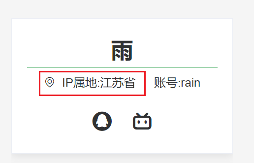

# Java集成ip2region2.x实现ip属地功能

## 效果图/封面



## 一、前言

如今许多软件如B站、微博、抖音等都加上 IP 归属地防止恶意评论，境外用户显示的是国家，国内的用户显示的省份。兴致一起，我便想自己的博客项目加上此功能。

目前存在几种方式：

- 方式一：IP地址库ip2region（本文采取的方式）

- 方式二：使用第三方API（查询效率低，不稳定，容易失效）
  1. ~~淘宝--IP库地址：`https://ip.taobao.com/`已经停止服务()~~
  2. 太平洋IP地址库`http://whois.pconline.com.cn/` 

## 二、ip2region简介

   ip2region - 准确率99.9%的离线IP地址定位库，0.0x毫秒级查询，ip2region.db数据库只有数MB，提供了java、php、c、python、nodejs、golang、c#等查询绑定和Binary,[B树](https://so.csdn.net/so/search?q=B树&spm=1001.2101.3001.7020),内存三种查询算法。

- 地址：

  GitHub地址：https://github.com/lionsoul2014/ip2region

  Gitee地址：https://gitee.com/lionsoul/ip2region

- 特性/优势

  1. 标准化的数据格式——每个 ip 数据段的 region 信息都固定了格式：国家|区域|省份|城市|ISP
  2. 数据去重和压缩
  3. 极速查询响应——即使是完全基于 xdb 文件的查询，单次查询响应时间在十微秒级别
  4. IP 数据管理框架

## 三、ip2region的使用

### 1、下载ip2region.db

将项目从GitHub/Gitee仓库down下来，找到data目录，有三种不同文件格式的ip地址库，进入找到[ip2region.xdb](https://gitee.com/lionsoul/ip2region/blob/master/data/ip2region.xdb)，将ip2region.xdb复制出来放到resources下。

### 2、pom.xml中引入依赖

```xml
<dependency>
     <groupId>org.lionsoul</groupId>
     <artifactId>ip2region</artifactId>
     <version>2.6.5</version>
 </dependency>
```

### 3、IpUtils工具类

其中有三个方法，

其一是去获取请求中的真实客户端ip。

其二是通过ip获取城市信息。

其三在服务启动时加载 ip2region.db 这个数据资源到内存中。

```java
package com.lll.blog.utils;

import com.baomidou.mybatisplus.core.toolkit.StringUtils;
import lombok.extern.slf4j.Slf4j;
import org.lionsoul.ip2region.xdb.Searcher;
import org.slf4j.Logger;
import org.slf4j.LoggerFactory;
import org.springframework.core.io.ClassPathResource;
import org.springframework.stereotype.Component;
import org.springframework.util.FileCopyUtils;

import javax.annotation.PostConstruct;
import javax.servlet.http.HttpServletRequest;
import java.io.InputStream;
import java.net.InetAddress;
import java.net.UnknownHostException;
import java.util.HashMap;
import java.util.Map;

@Slf4j
@Component
public class IPUtils {

    private static Logger logger = LoggerFactory.getLogger(IPUtils.class);

    private static Searcher searcher;

    /**
     * 获取客户端IP地址
     *
     * 使用Nginx等反向代理软件， 则不能通过request.getRemoteAddr()获取IP地址
     * 如果使用了多级反向代理的话，X-Forwarded-For的值并不止一个，而是一串IP地址，X-Forwarded-For中第一个非unknown的有效IP字符串，则为真实IP地址
     */
    public static String getIpAddr(HttpServletRequest request) {
        String ip = null;
        try {
            ip = request.getHeader("x-forwarded-for");
            if (StringUtils.isEmpty(ip) || "unknown".equalsIgnoreCase(ip)) {
                ip = request.getHeader("Proxy-Client-IP");
            }
            if (StringUtils.isEmpty(ip) || ip.length() == 0 || "unknown".equalsIgnoreCase(ip)) {
                ip = request.getHeader("WL-Proxy-Client-IP");
            }
            if (StringUtils.isEmpty(ip) || "unknown".equalsIgnoreCase(ip)) {
                ip = request.getHeader("HTTP_CLIENT_IP");
            }
            if (StringUtils.isEmpty(ip) || "unknown".equalsIgnoreCase(ip)) {
                ip = request.getHeader("HTTP_X_FORWARDED_FOR");
            }
            if (StringUtils.isEmpty(ip) || "unknown".equalsIgnoreCase(ip)) {
                ip = request.getRemoteAddr();
                if ("127.0.0.1".equals(ip) || "0:0:0:0:0:0:0:1".equals(ip)) {
                    //根据网卡取本机配置的IP
                    InetAddress inet = null;
                    try {
                        inet = InetAddress.getLocalHost();
                    } catch (UnknownHostException e) {
                        log.error("getIpAddress exception:", e);
                    }
                    ip = inet.getHostAddress();
                }
            }
        } catch (Exception e) {
            logger.error("IPUtils ERROR ", e);
        }
        return ip;
    }

    /**
     * 根据ip从 ip2region.db 中获取地理位置
     *
     * @param ip
     * @return 地理位置
     */
    public static Map getCityInfo(String ip) {
        //数据格式： 国家|区域|省份|城市|ISP
        //192.168.31.160 0|0|0|内网IP|内网IP
        //47.52.236.180 中国|0|香港|0|阿里云
        //220.248.12.158 中国|0|上海|上海市|联通
        //164.114.53.60 美国|0|华盛顿|0|0
        HashMap<String, Object> cityInfo = new HashMap<>();
        try {
            String searchIpInfo = searcher.search(ip);
            String[] splitIpInfo = searchIpInfo.split("\\|");
            cityInfo.put("ip",ip);
            cityInfo.put("searchInfo", searchIpInfo);
            cityInfo.put("country",splitIpInfo[0]);
            cityInfo.put("region",splitIpInfo[1]);
            cityInfo.put("province",splitIpInfo[2]);
            cityInfo.put("city",splitIpInfo[3]);
            cityInfo.put("ISP",splitIpInfo[3]);
            return cityInfo;
        } catch (Exception e) {
            log.info("failed to search(%s): %s\n", ip, e);
        }
        return null;
    }

    /**
     * 在服务启动时加载 ip2region.db 到内存中
     * 解决打包jar后找不到 ip2region.db 的问题
     *
     * @throws Exception 出现异常应该直接抛出终止程序启动，避免后续invoke时出现更多错误
     */
    @PostConstruct
    private static void initIp2regionResource() {
        try {
            InputStream inputStream = new ClassPathResource("/ipdb/ip2region.xdb").getInputStream();
            byte[] dbBinStr = FileCopyUtils.copyToByteArray(inputStream);
            // 创建一个完全基于内存的查询对象
            searcher = Searcher.newWithBuffer(dbBinStr);
        } catch (Exception e) {
            log.info("failed to create content cached searcher: %s\n", e);
        }
    }

}
```

### 4、测试类

```java
package com.lll.blog.controller;

import com.lll.blog.utils.IPUtils;
import org.springframework.stereotype.Controller;
import org.springframework.web.bind.annotation.GetMapping;
import org.springframework.web.bind.annotation.ResponseBody;

import javax.servlet.http.HttpServletRequest;
import java.util.Map;


/**
 * @author Rain
 * @date 2022/10/28 15:57
 */
@Controller
public class IpController {

    @GetMapping(value = "/testIp")
    @ResponseBody
    public Object testIp(HttpServletRequest request) {

        String ipAddr = IPUtils.getIpAddr(request);
        Map cityInfo = IPUtils.getCityInfo(ipAddr);
        System.out.println(cityInfo.get("province"));
        //数据格式： 国家|区域|省份|城市|ISP
        //192.168.31.160 0|0|0|内网IP|内网IP
        //47.52.236.180 中国|0|香港|0|阿里云
        //220.248.12.158 中国|0|上海|上海市|联通
        //164.114.53.60 美国|0|华盛顿|0|0
        String ip = "183.213.81.138";
        Map result = IPUtils.getCityInfo(ip);
        System.out.println(result.get("province"));
        return cityInfo;
    }
}
```

## 四、需求实现-博客项目归属地

项目技术：Springboot + Vue

### 1、后端

**Controller**

```
package com.lll.blog.controller;

import com.lll.blog.service.SysUserService;
import com.lll.blog.utils.IPUtils;
import com.lll.blog.vo.Result;
import org.springframework.beans.factory.annotation.Autowired;
import org.springframework.web.bind.annotation.*;

import javax.servlet.http.HttpServletRequest;
import java.util.Map;

@RestController
@RequestMapping("users")
public class UsersController {

    @Autowired
    private SysUserService SysUserService;
    
    @GetMapping("getIpRegion")
    public Result getIpRegion(HttpServletRequest request){
        String ipAddr = IPUtils.getIpAddr(request);
        return SysUserService.getIpRegion(ipAddr);
    }
}
```

**Service**

```
public interface SysUserService {

    Result getIpRegion(String ip);
}
```

**Impl**

```
package com.lll.blog.service.impl;

import com.lll.blog.utils.IPUtils;
import com.lll.blog.vo.ErrorCode;
import com.lll.blog.vo.Result;

import java.util.Map;


@Service
public class SysUserServiceImpl implements SysUserService {

    @Override
    public Result getIpRegion(String ip) {
        Map cityInfo = IPUtils.getCityInfo(ip);
        if ("中国".equals(cityInfo.get("country"))){
            System.out.println(cityInfo.get("province"));
            Object province = cityInfo.get("province");
            return Result.success(province);
        }
        else if ("0".equals(cityInfo.get("country"))){
            System.out.println(cityInfo);
            if ("内网IP".equals(cityInfo.get("ISP"))){
                return Result.success("内网");
            }
            return Result.success("未知");
        }
        else {
            System.out.println(cityInfo.get("country"));
            return Result.success(cityInfo.get("country"));
        }
    }

}
```

### 2、前端

(下面仅仅展示部分关键代码)

**api**

```
export function getIpRegionInfo() {
  return request({
    url: '/users/getIpRegion',
    method: 'get'
  })
```

**vue页面**

```vue
<template>
  <el-card>
    <div class="me-author-description" v-if="!user.login">
      <span><i class="el-icon-location-outline"></i> &nbsp;IP属地:{{ip}}</span>
    </div>
  </el-card>
</template>


<script>
  import {getIpRegionInfo} from '@/api/login'

  export default {
    name: 'CardMe',
    created() {
      this.getIpRegionInfo()
    },
    data() {
      return {
        ip: null,
      }
    },
    methods: {
      getIpRegionInfo() {
        getIpRegionInfo().then((data => {
          this.ip = data.data
        })).catch(error => {
          if (error !== 'error') {
            that.$message({type: 'error', message: 'ip归属地获取失败!', showClose: true})
          }
        })
      }
    }
  }
</script>
```

## 五、扩展

### 1、好文

- [深入浅出之ip2region实现](https://segmentfault.com/a/1190000039019933)

- ip2region2.x

  [Java 根据 IP 地址来获取 位置 -- 使用 ip2region](https://blog.csdn.net/weixin_42144379/article/details/84900446?spm=1001.2101.3001.6650.19&utm_medium=distribute.pc_relevant.none-task-blog-2%7Edefault%7EBlogCommendFromBaidu%7ERate-19-84900446-blog-120698683.pc_relevant_default&depth_1-utm_source=distribute.pc_relevant.none-task-blog-2%7Edefault%7EBlogCommendFromBaidu%7ERate-19-84900446-blog-120698683.pc_relevant_default&utm_relevant_index=22)

  [使用强大的离线IP地址定位库ip2region获取城市信息](https://blog.csdn.net/sinat_27933301/article/details/123170533?utm_medium=distribute.pc_relevant.none-task-blog-2~default~baidujs_baidulandingword~default-0-123170533-blog-124451706.pc_relevant_3mothn_strategy_and_data_recovery&spm=1001.2101.3001.4242.1&utm_relevant_index=3)

- 1.x

  [IP获取城市-Java调用ip2region](https://malian.tech/article/111345)

### 2、待尝试

- [mica 2.0.1 发布新增最好用的 ip2region boot stater](https://segmentfault.com/a/1190000022622489)

- @IP注解

  后续有时间尝试一下 @IP注解切面开发[参考](https://blog.csdn.net/weixin_33005117/article/details/125599192?spm=1001.2101.3001.6650.8&utm_medium=distribute.pc_relevant.none-task-blog-2%7Edefault%7EBlogCommendFromBaidu%7ERate-8-125599192-blog-107375608.pc_relevant_default&depth_1-utm_source=distribute.pc_relevant.none-task-blog-2%7Edefault%7EBlogCommendFromBaidu%7ERate-8-125599192-blog-107375608.pc_relevant_default&utm_relevant_index=9)

  之后在接口方法上加上 @IP 注解就可以实现监控Controller接口的访问地址