## ElasticSearch下载安装及使用

### 前言

Elasticsearch是一个基于Lucene的搜索服务器。它提供了一个分布式的全文搜索引擎，基于restful web接口。Elasticsearch是用Java语言开发的，基于Apache协议的开源项目，是目前最受欢迎的企业搜索引擎。Elasticsearch广泛运用于云计算中，能够达到实时搜索，具有稳定，可靠，快速的特点。

由于是个人开发环境，准备尝试最新的版本，不怕核心业务出问题，而且可以享受新版本的新功能、高性能等优点，保持自己技术的不断演进。本次尝试新版本V8.5.1。

不过要注意一下版本对应关系

https://docs.spring.io/spring-data/elasticsearch/docs/4.0.1.RELEASE/reference/html/#new-features

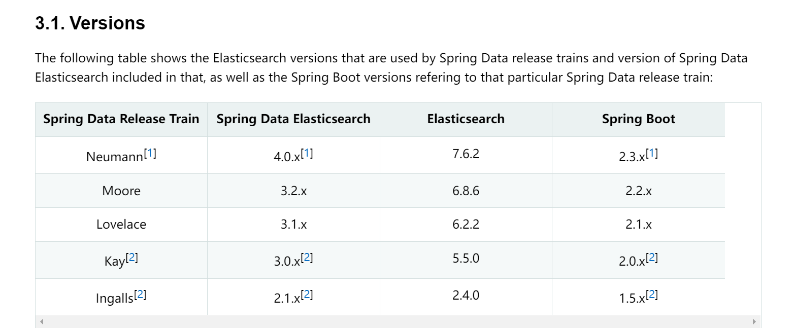


- 下载地址：https://www.elastic.co/cn/downloads/past-releases

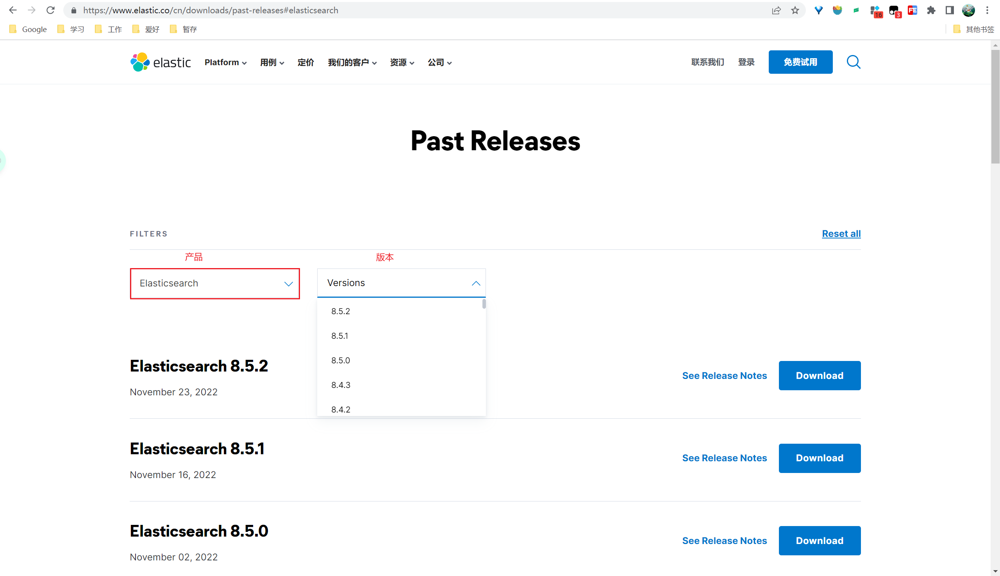


- elasticsearch默认端口为9200；
- Kibana默认端口为5601。

### 安装

####  Elasticsearch

1、下载

下载Elasticsearch zip包，并解压到指定目录，下载地址：https://www.elastic.co/cn/downloads/elasticsearch

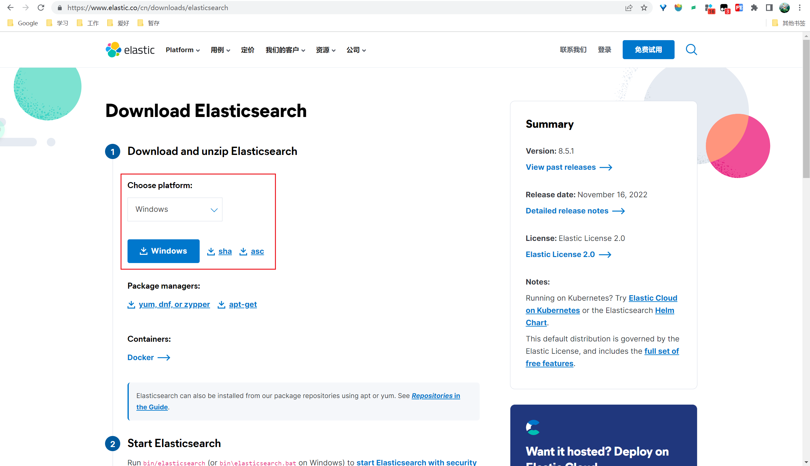

2、启动（获取登录密码）

运行bin目录下的elasticsearch.bat启动Elasticsearch；

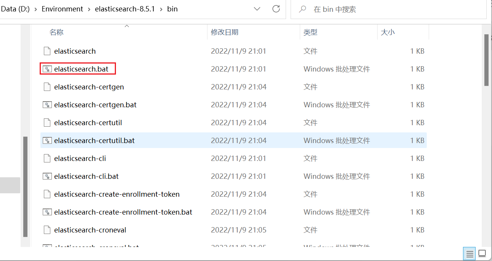

出现如下

```
warning: ignoring JAVA_HOME=D:\Environment\Java\jdk1.8.0_281; using bundled JDK
```

回车即可。

账号和密码记录起来关闭下面页面

```
elastic
TetT4MAcOLew5x-nrUhR
```

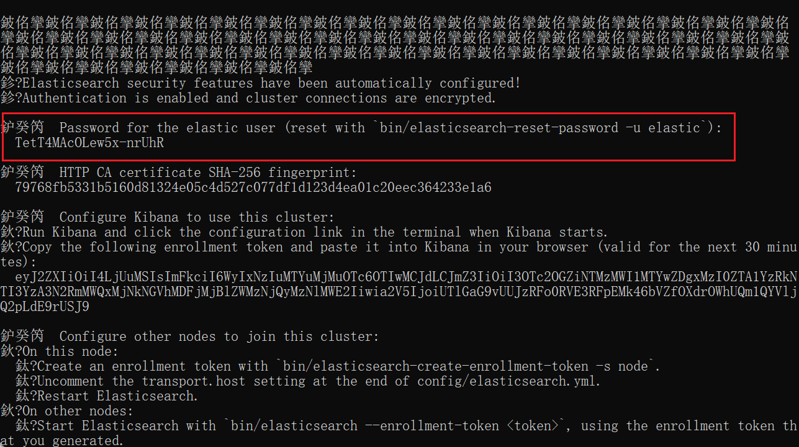

3、修改yml配置文件

打开config 目录下面的 elasticsearch.yml 文件，把加密关闭

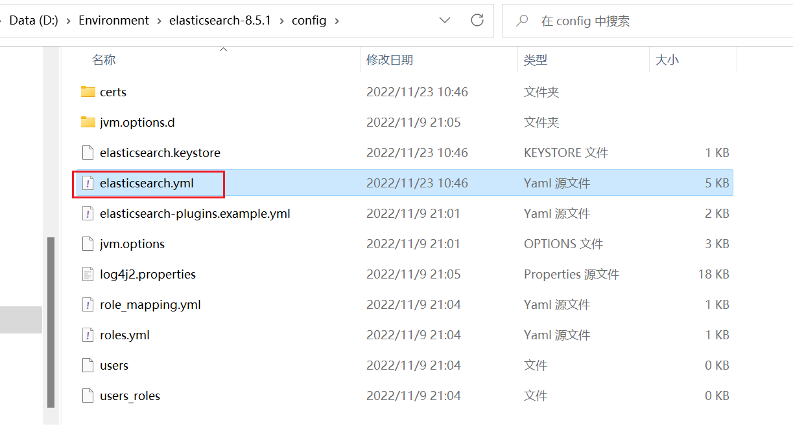

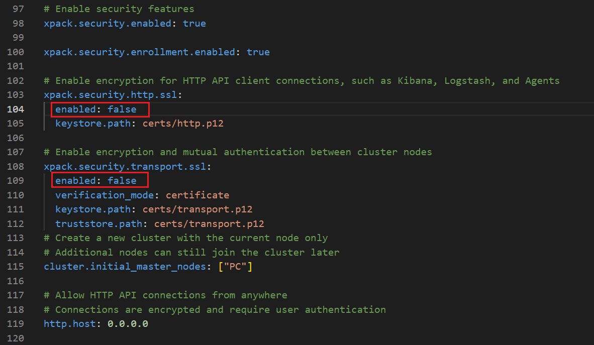


建议可以把所有的（4个）`enabled：true改成false`

不然还会报错，当然修改也可以运行。

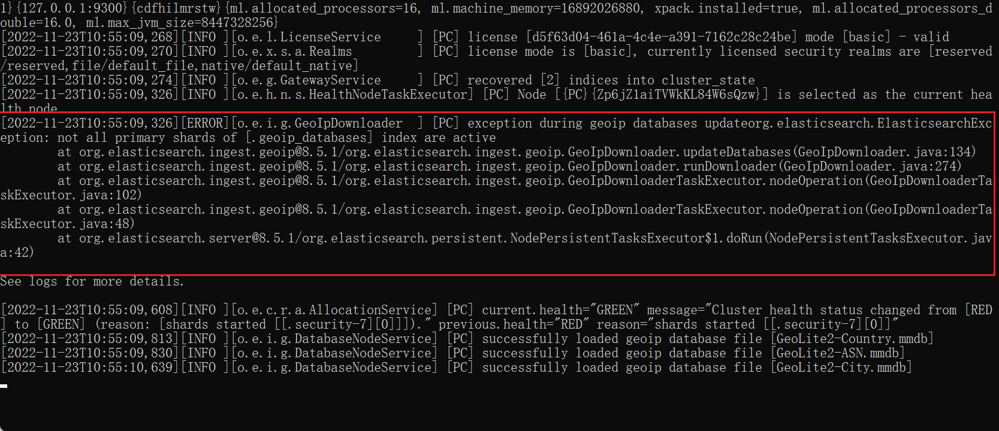

4、重启登录

修改之后记得保存关闭，重新双击bin目录下面的 elasticsearch.bat ，浏览器打开 localhost:9200输入账号密码


登录成功可见

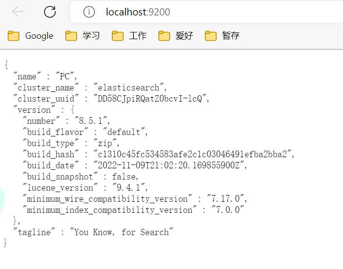

5、其他操作

- 其一，创建 “kibana_system”用户

进入es的bin目录下打开命令行界面，创建用户保存密码，输入命令：

```
bin\elasticsearch-reset-password -u kibana_system
```

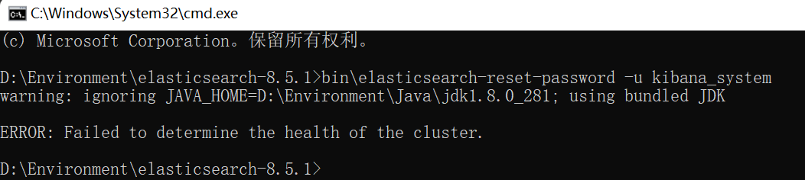

注意创建用户要确定启动es

否则报错：`ERROR: Failed to determine the health of the cluster`

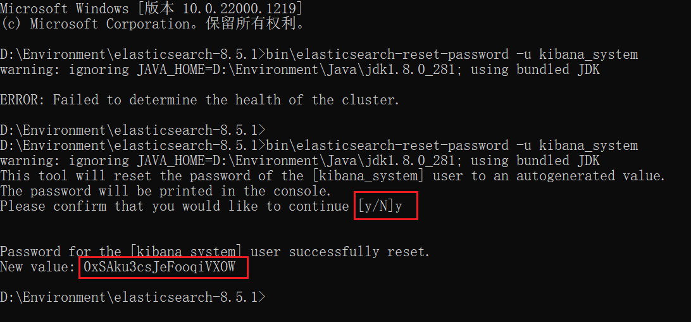

保存密码`0xSAku3csJeFooqiVXOW`，后续配置Kibana会用到。

- 其二，安装中文分词插件（后续补充详细操作）

#### Kibana

1、下载Kibana（注意版本对应）

Kibana是访问Elasticsearch的客户端，下载完成后解压到指定目录，下载地址：https://www.elastic.co/cn/downloads/past-releases#kibana


2、配置

第一步，要有创建 的“kibana_system”用户（上文已创建），没有创建即可。

第二步，打开kibana的config文件夹中的kibana.yml，添加配置信息。	

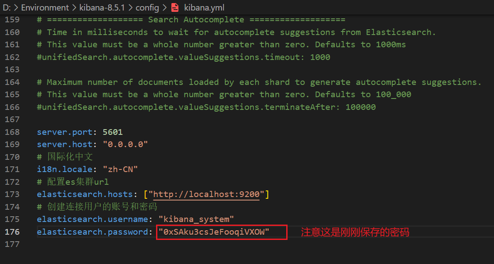

  kibana.yml添加如下配置

   ```
   server.port: 5601  
   server.host: "0.0.0.0"
   # 国际化中文
   i18n.locale: "zh-CN"
   # 配置es集群url
   elasticsearch.hosts: ["http://localhost:9200"] 
   # 创建连接用户的账号和密码，注意此密码是创建连接用户时保存的密码
   elasticsearch.username: "kibana_system"
   elasticsearch.password: "0xSAku3csJeFooqiVXOW"   
   ```

3、启动

运行bin目录下的kibana.bat，启动Kibana的用户界面

4、访问

浏览器打开 localhost:5601即可打开Kibana的用户界面，出现如下界面表示运行成功。

> 注意密码为 elasticsearch的账号密码 
>
> 账号：elastic
>
> 密码：启动elasticsearch时保存的密码

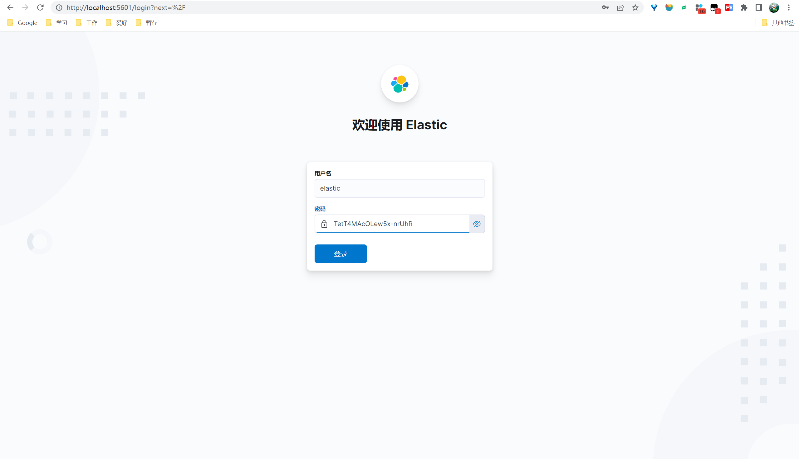

登录后暂时选择自己浏览


进入到系统界面如图


### 入门使用体验

通过kibana登录elasticsearch进入控制台操作一下。

登录kibana点击左侧菜单 => Management => 开发工具


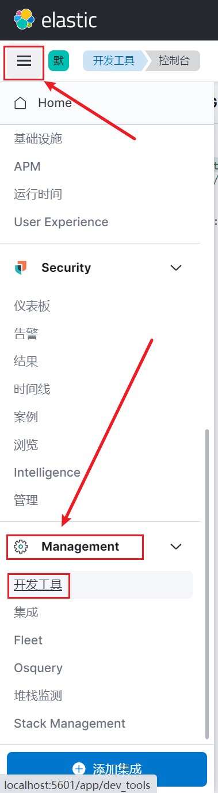

进入控制台


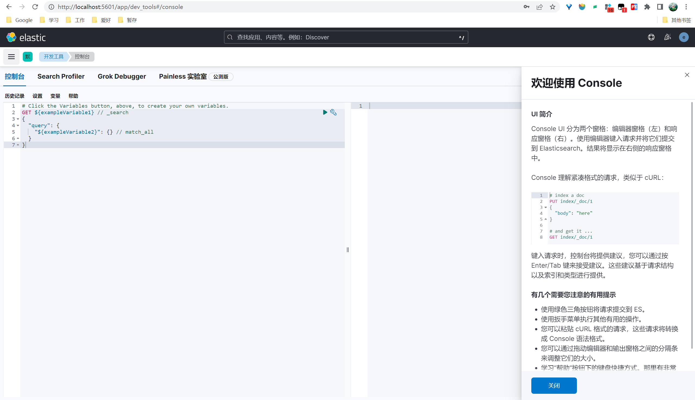


操作1：查询所有节点

控制台输入请求，点击发送请求，右侧展示结果。

```powershell
GET /_cat/nodes?v 
```

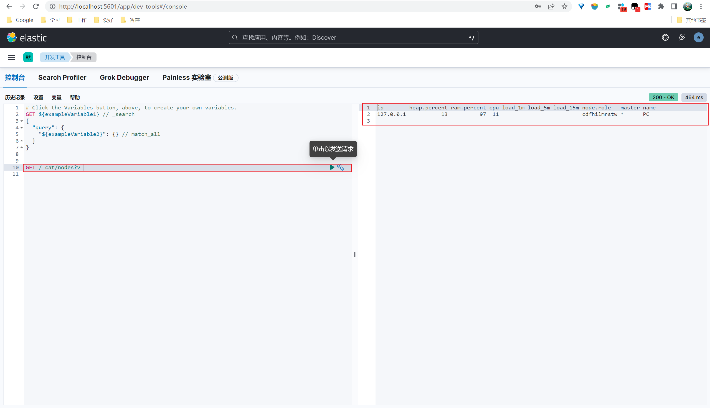

操作2：默认的分析器

standard 是默认的分析器。它提供了基于语法的标记化（基于Unicode文本分割算法），适用于大多数语言。

```fsharp
POST _analyze
{
  "analyzer": "standard",
  "text":     "新年大吉"
}
```
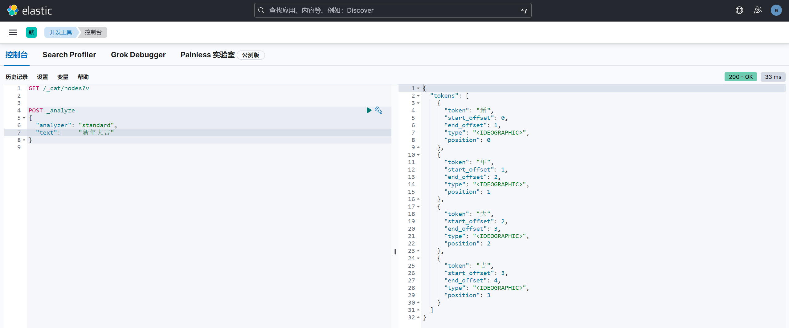
