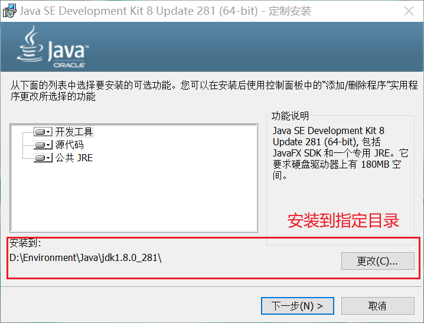
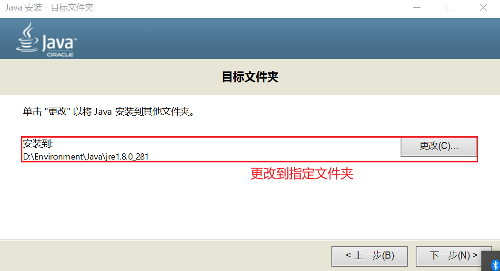
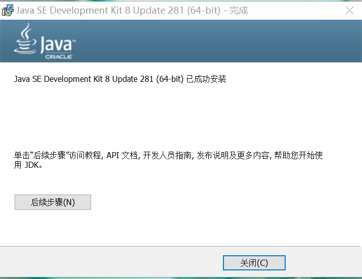
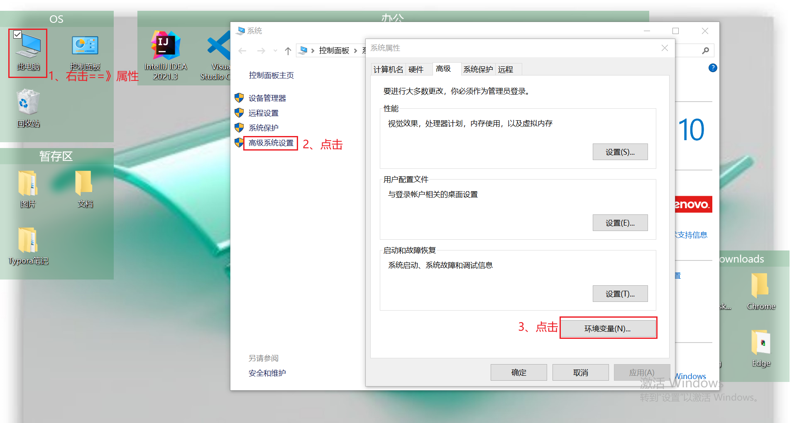
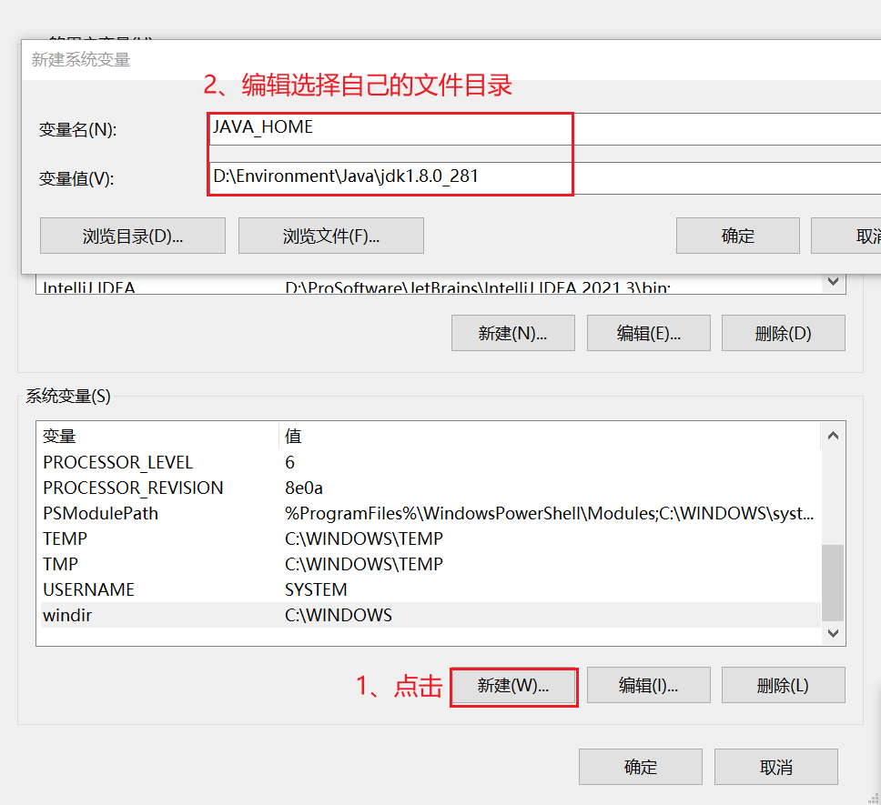
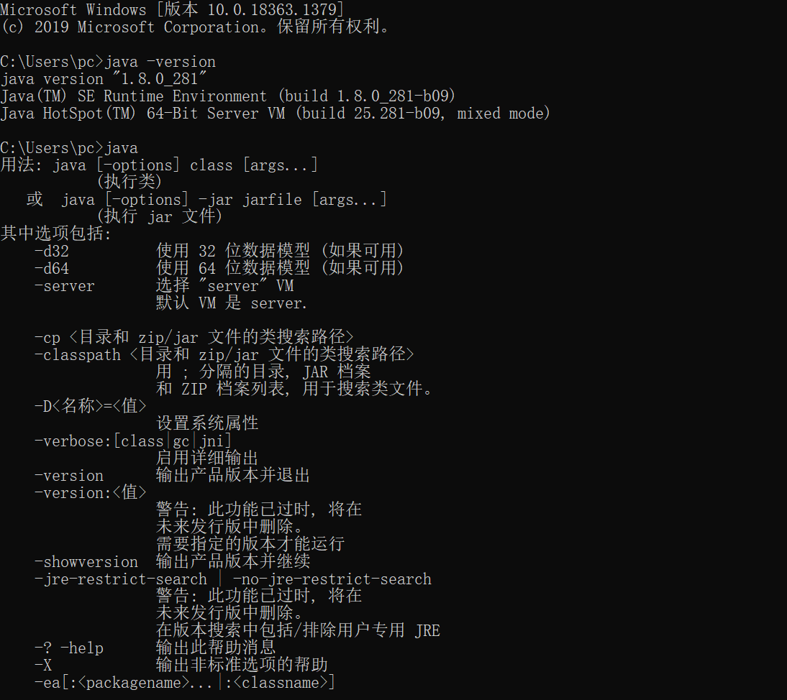
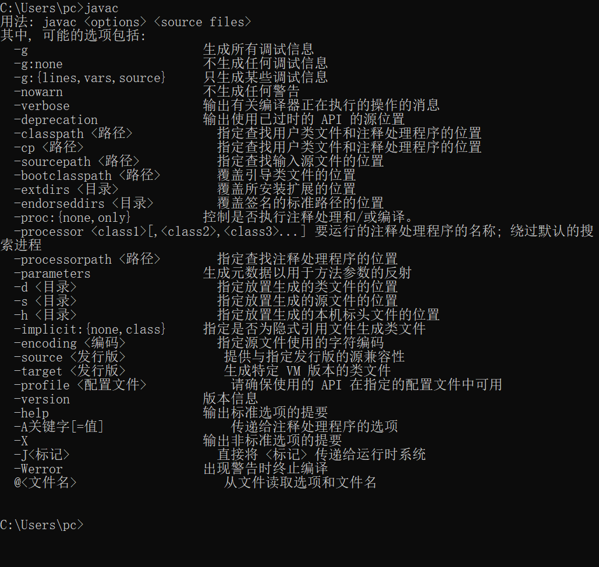

1. 下载安装包

   https://www.oracle.com/java/technologies/downloads/

2. 双击exe文件进入安装

3. 选择指定目录安装jdk

   

4. 选择指定目录安装jre

   

5. 安装完成

   

6. 配置环境变量

   - 我的电脑右击，再点击属性找到高级系统设置，再点击环境变量进行配置。

   

   - 配置
      ```
           变量名：JAVA_HOME
           变量值：D:\Environment\Java\jdk1.8.0_281   // 要根据自己的实际路径配置
      
           变量名：Path
           变量值：%JAVA_HOME%\bin;%JAVA_HOME%\jre\bin;
      ```
      


7. 测试

   windows键+R键，键入cmd；

   键入命令: java -version、java、javac 几个命令，出现以下信息，说明环境变量配置成功；

   

   
