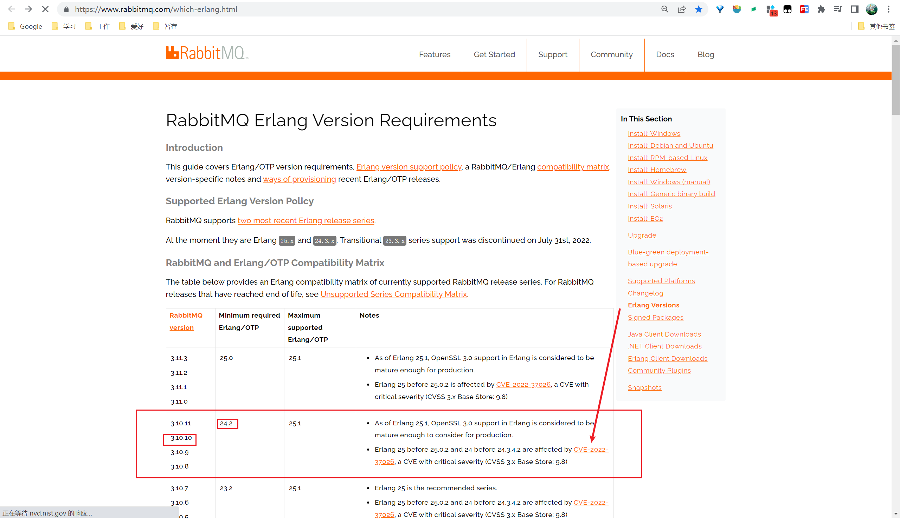
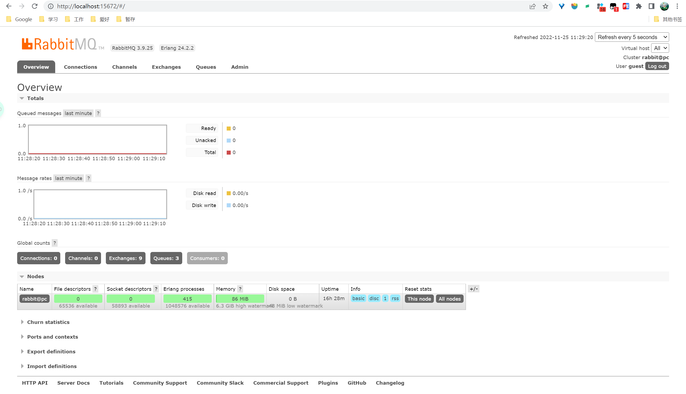

## 前言

Rabbitmq是一个消息队列

Erlang 可视化工具

注意Rabbitmq和Erlang是有版本对应关系的

查看地址：https://www.rabbitmq.com/which-erlang.html



下文安装使用24.2.2+v3.10

## 安装

首先进入RabbitMQ官网，下载最新的RabbitMQ安装包  

网址：http://www.rabbitmq.com/install-windows.html

RabbitMQ的github地址：https://github.com/rabbitmq/rabbitmq-server/releases/tag/v3.10.10

Erlang的github地址：https://github.com/erlang/otp/releases/tag/OTP-24.2.2


1、下载好后傻瓜式安装
需要注意两点：
- 先安装Erlang后，才能够安装RabbitMQ，因为RabbitMQ是基于Eralng语言开发的。
- 主机名不能是中文名称


2、安装完成后进入RabbitMq安装目录下的\sbin目录下，输入下面命令，启动图形化界面

```
# 开启图形化界面
rabbitmq-plugins enable rabbitmq_management
```

本地浏览器输入 http://localhost:15672

会打开图形化管理页面，账号和密码都是  guest


登录成功后如图



==后续补充项目中使用==
