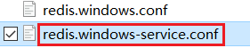
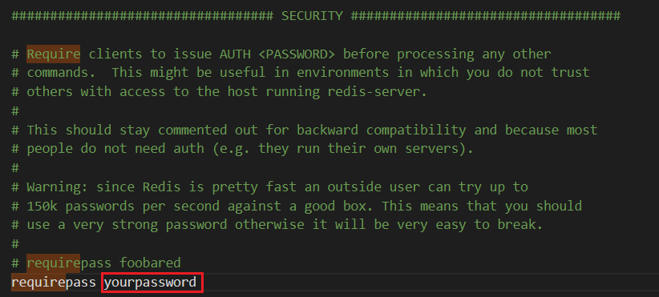
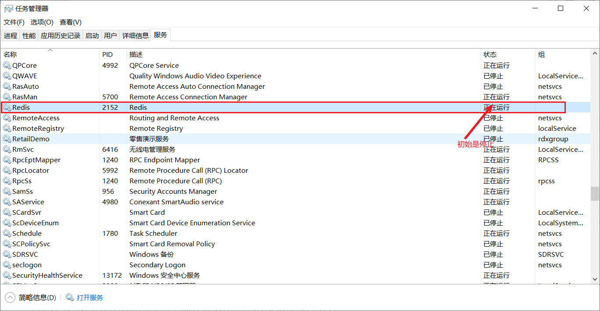
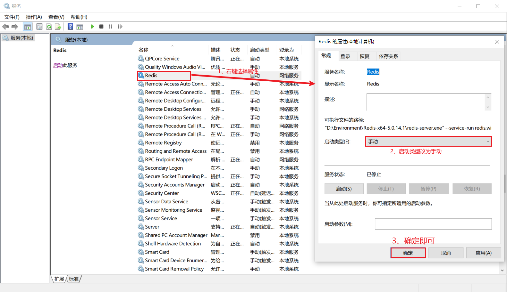
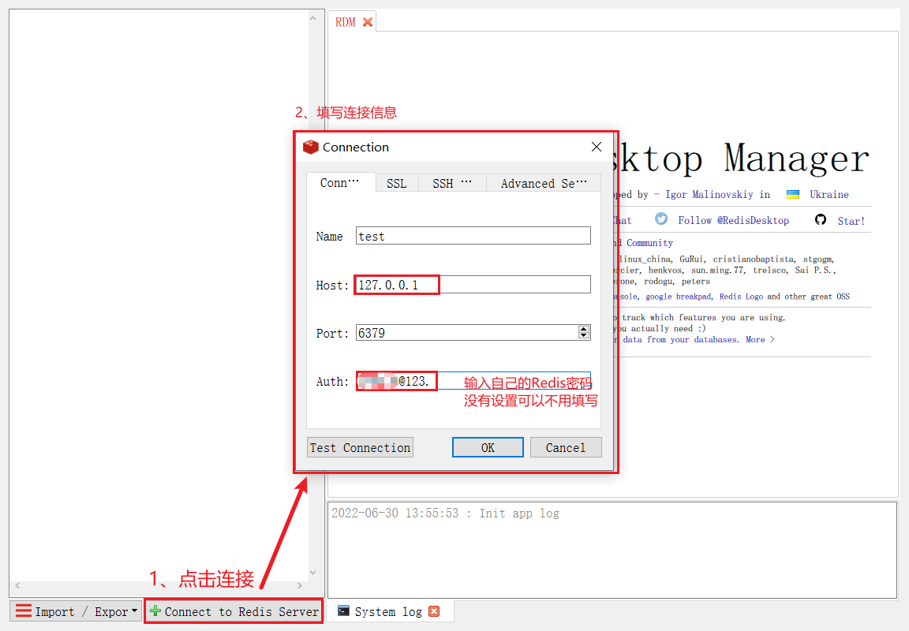

# Windows下Redis解压包安装及配置教程

## Redis下载及配置

### 下载redis 

Github下载地址：https://github.com/MicrosoftArchive/redis/releases

官网下载地址：https://redis.io/download/

### 解压压缩包

解压到自己的指定目录即可

### 修改设置密码

到配置文件中设置，就是 redis 安装路径下/redis.windows-service.conf 这个文件，注意不是另外一个易混淆文件redis.windows.conf。



配置文件中如下图位置添加
`requirepass 你想设置的密码`




### 启动Redis服务端

先临时直接双击`redis-server.exe`运行服务即可，当然此方案不好，会有问题，后续解决。

### 连接Redis服务端

双击`redis-cli.exe`进入界面，若配置文件配置了密码，输入密码连接，如果原本配置文件不配置密码的话输入`ping`命令收到`pong`表示连接成功了。

## 将Redis设置成服务并开机自启

### 需求背景

每次启动 redis 都要去到 Redis 安装目录下寻找 redis-server.exe 文件点击，很是麻烦。

另外启动后只要一关闭cmd窗口，redis服务就关闭了。也是一大头疼问题。

于是思考到可不可以跟其它服务一样能够开机自启？显然是可以的。

把 redis 设置为一个 windows 服务便可以解决此问题。

### Redis 设置为服务

进入redis文件夹，输入`redis-server.exe --service-install redis.windows.conf --loglevel verbose` 出现如下情况即将 Redis 设置为服务。

其中参数 --loglevel verbose表示记录日志等级

```
D:\Environment\Redis-x64-5.0.14.1>redis-server.exe --service-install redis.windows.conf --loglevel verbose
[6924] 30 Jun 11:01:39.652 # Granting read/write access to 'NT AUTHORITY\NetworkService' on: "D:\Environment\Redis-x64-5.0.14.1" "D:\Environment\Redis-x64-5.0.14.1\"
[6924] 30 Jun 11:01:39.654 # Redis successfully installed as a service.
```

### 查看并设置 Redis 的服务

鼠标右键「任务栏」–> 点击「任务管理器」–> 选择「服务」选项 –> 点击下方「打开服务」按钮，打开服务窗口之后就可以找到 Redis 的服务



如果不想设置为自启动，如下将启动方式改为手动启动即可。



### 开启与关闭 Redis 服务

在重启电脑之后，就可以直接在命令行操作 Redis 服务了

基本命令：

```
#开启服务 
redis-server --service-start

#关闭服务 
redis-server --service-stop

#卸载服务 
redis-server --service-uninstall

#服务重命名 
redis-server --service-name server-name
```
**4、扩展**

- 其他操作系统 Redis 启动设置

   参考文章：[centos7 源码安装redis设置开机自启](https://blog.csdn.net/FZlion/article/details/109535797?spm=1001.2101.3001.6650.1&utm_medium=distribute.pc_relevant.none-task-download-2%7Edefault%7ECTRLIST%7EPaid-1-14888871-blog-109535797.pc_relevant_multi_platform_whitelistv1&depth_1-utm_source=distribute.pc_relevant.none-task-download-2%7Edefault%7ECTRLIST%7EPaid-1-14888871-blog-109535797.pc_relevant_multi_platform_whitelistv1&utm_relevant_index=2)

- Redis主从服务安装（待扩展）  

  主从服务可以实现负载均衡，其实就是把上面Redis安装文件包，拷贝到相应目录，修改主、从服务器配置文件中IP、Port，同时从服务器要指定主服务器 的IP、Port，按照Redis自定义服务安装中命令进行服务安装、服务启动、服务关闭、服务卸载即可使用。

## 可视化工具RedisDesktopManager

### 下载安装包

官网下载：https://redisdesktop.com/download

github地址：https://github.com/uglide/RedisDesktopManager/releases

不过由于目前收费，需要可以去找一下网盘安装包

### 安装 

点击下载的 exe 文件，傻瓜式安装，下一步即可。

### 创建连接

在创建连接前注意检查一下自己的 Redis 是否开启。开启后如下图可视化连接即可。



### 其他可视化工具

[Redis可视化工具](https://www.jianshu.com/p/721c3762a777)