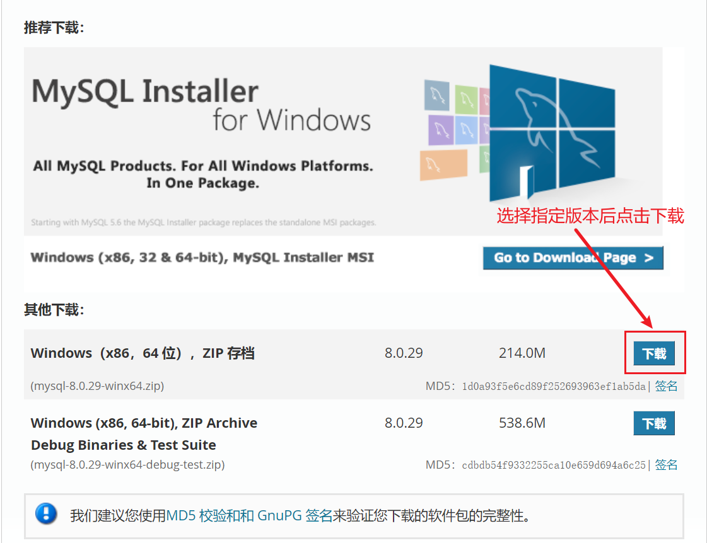
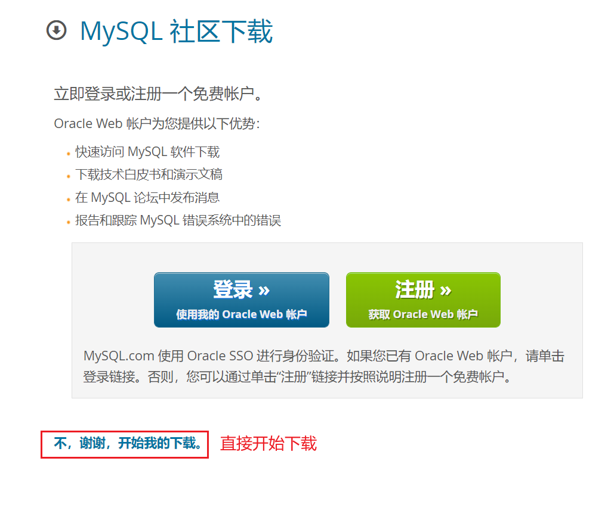
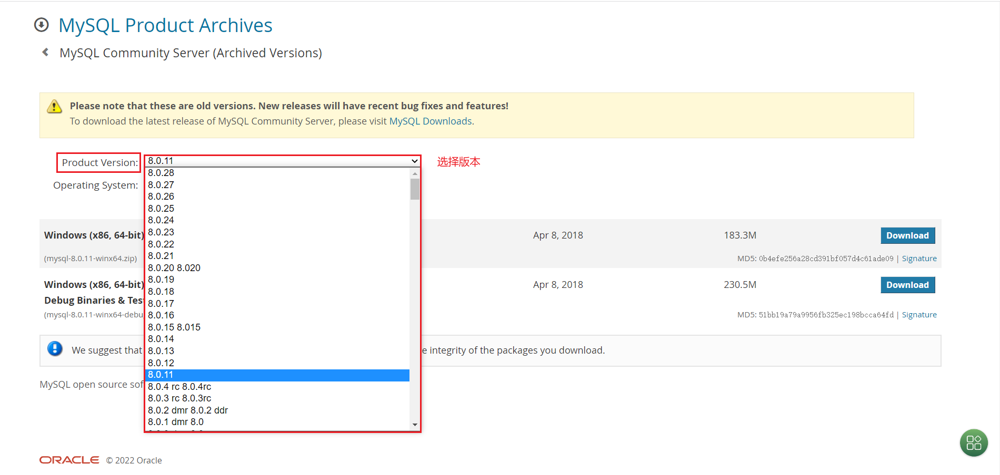
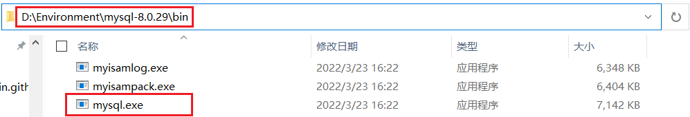
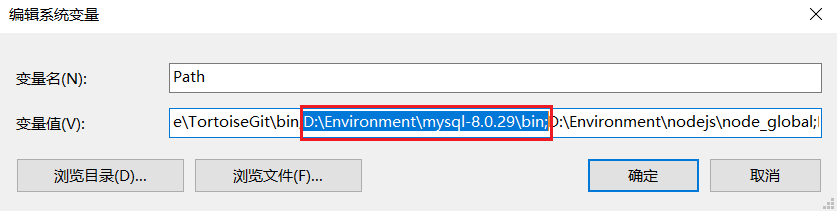
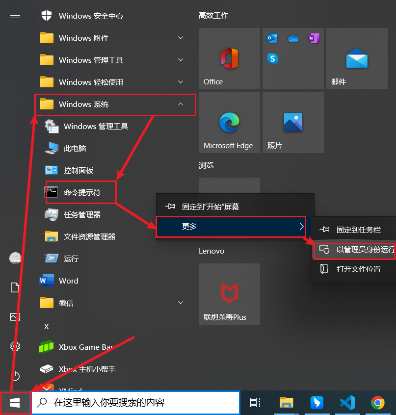
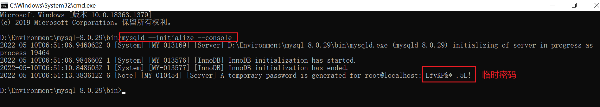
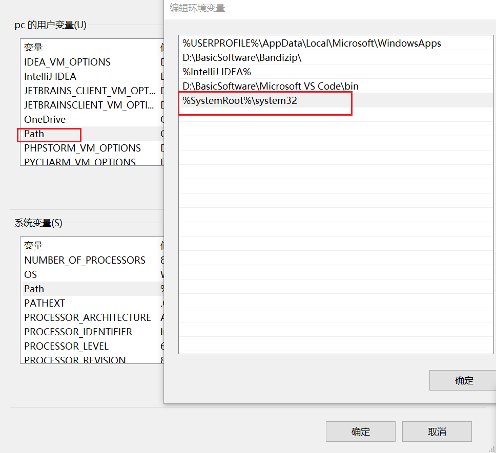
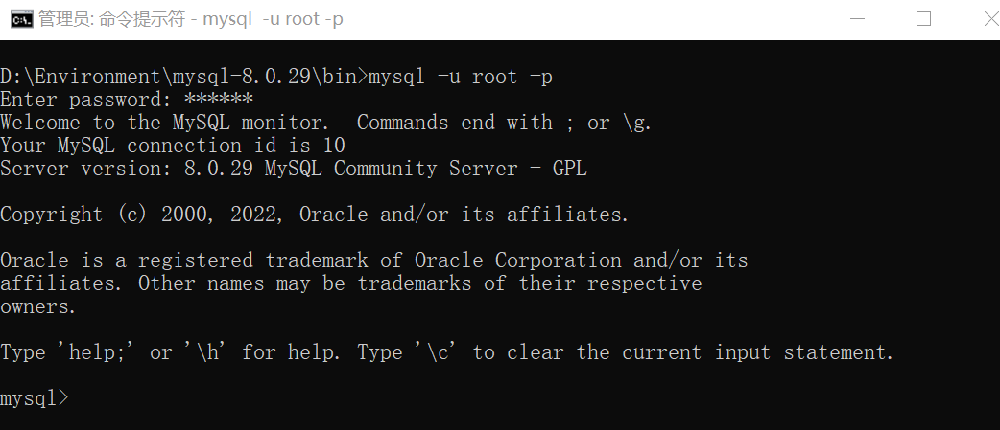

## mysql8.0.29winx64解压安装

1. 下载安装包

   下载链接：https://dev.mysql.com/downloads/mysql/

   

   不登陆注册直接下载。

   

   想下载往期版本可以选择指定版本瞎下载:https://downloads.mysql.com/archives/community/

   


2. 下载后的压缩文件解压到指定目录（注意路径不要带空格或者汉字，否则容易报错）

3. 配置环境变量

   找到mysql下的bin目录如!

   

   在我的电脑，右击属性找到高级系统设置==》系统变量的path中配置如下。

   


4. Windows+R键盘进入命令行(注意最好是以管理员身份进入，不然下面可能报错)，并切换到bin目录下

   ```
   C:\WINDOWS\system32>d:
   
   D:\>cd D:\Environment\mysql-8.0.29\bin
   ```

   


   >在MySQL解压路径下，新建my.ini 配置初始化参数：(查看网上好多教程有此步骤，但是个人选择忽略了此步骤，无伤大雅)


    ```
    [mysql]
    
    # 设置mysql客户端默认字符集
    
    default-character-set=utf8
    
    [mysqld]
    
    #设置3306端口
    
    port = 3306
    
    # 设置mysql的安装目录
    
    basedir=D:\Java\mysql-xxx
    
    # 设置mysql数据库的数据的存放目录
    
    datadir=D:\Java\mysql-xxx\data
    
    # 允许最大连接数
    
    max_connections=200
    
    # 服务端使用的字符集默认为8比特编码的latin1字符集
    
    character-set-server=utf8
    
    # 创建新表时将使用的默认存储引擎
    
    default-storage-engine=INNODB
    ```

5. 命令行初始化，命令行下载

   注意如果不是管理员身份进入命令行，install会报错 Service successfully installed.

   ```
   D:\Environment\mysql-8.0.29\bin>mysqld --install
   Service successfully installed.
   ```
  
   命令行初始化

   ```
   D:\Environment\mysql-8.0.29\bin>mysqld --initialize --console
   ```
   注意记住这个临时密码，后面会用到;

   

    可能报错：`initialize specified but the data directory has files in it. Aborting`

    原因：初始化时可能会初始化多次，或者原本拷贝的解压包data已经有数据。

    暴力方案：将目录mysql/data目录下内容暴力删除后即可。


6. 启动

   `net start mysql`可能报错'net' 不是内部或外部命令，也不是可运行的程序 或批处理文件。

   解决方案：

   首先确认C:\Windows\System32这个目录下面是否存在net.exe文件，如果有，去配置环境变量，用户变量path中添加如下`%SystemRoot%\system32`

   

6. 临时密码登录并修改密码

   ```
   D:\Environment\mysql-8.0.29\bin>mysql -u root -p
   Enter password: ************     #输入临时密码

   mysql> alter user 'root'@'localhost' identified by '123456';
   ```
   补充查阅其他资料有的说，与5.X版本不同，8已经不支持PASSWORD()方法，若报错可采用如下，未报错直接忽略。

   注意8.0建议使用下面修改方式，已验证，否则后面客户端DBeaver连接会报错 [Bug0045] `Public Key Retrieval is not allowed `

   `ALTER USER 'root'@'localhost' IDENTIFIED WITH mysql_native_password BY 'password';`

7. 登录成功

   


8. 可视化工具连接

   Navicat   DBeaver  SQLyong  后续讲解安装破解。
   
   
