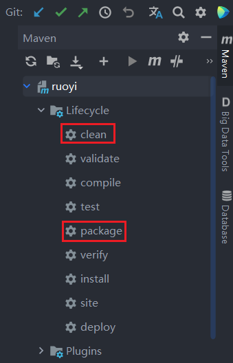
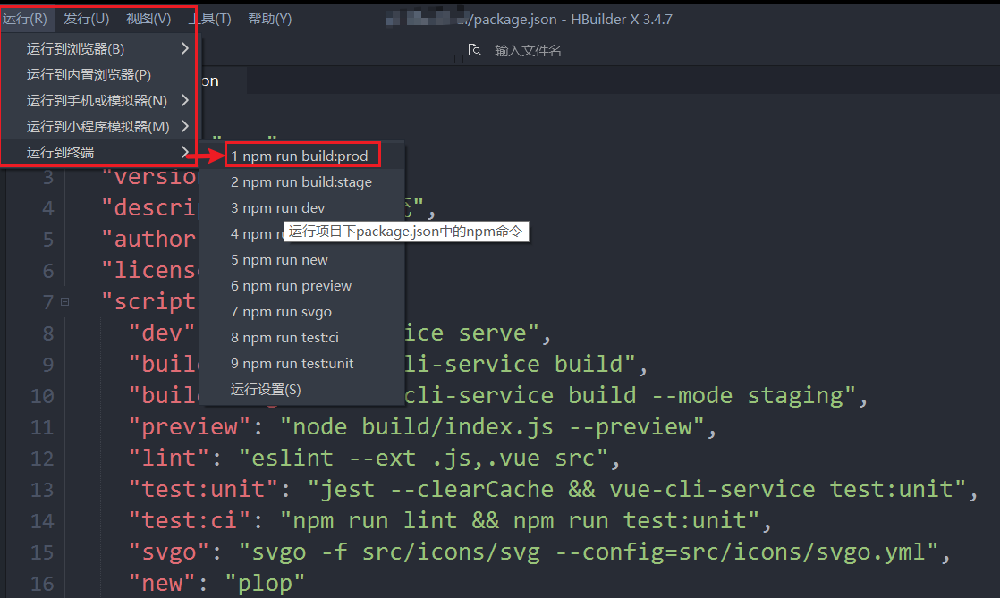
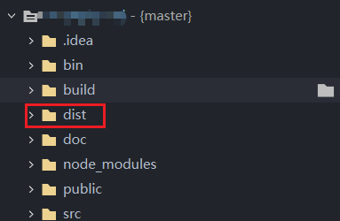

## 需求描述

使用若依的前后端分离框架做的一个项目，想要部署到另外一台windows电脑（服务器）上，作为小白写一篇文档总结记录一下。

## 电脑环境准备

- JDK1.8 
- Nginx（注意配置，不要直接点击exe启动）
- Redis服务（直接下载运行不设置服务也可以）
- Mysql （或者直接打 jar 包时使用远程 sql 服务器地址）

## 打包

- 后端打 jar 包（由于已经配置好目录位置，========待补充如何配置=============）
  
  cleany -> package 然后到指定目录扎到 jar 包即可。

  

- 前端打包

  在package.json中配置，也可以使用编辑器如 Hbuilder -> 运行 -> 运行到终端 -> npm run build 

  

  然后去目录下查看dist文件夹，这个文件夹得内容即是打包好的前端内容。

  

## 部署

将jar包和dist文件拷贝到部署电脑上

- 启动数据库（如果使用本地数据库）

- 启动Redis服务

- 运行后台的jar包（`java -jar 后端jar包目录`）。

- 配置Nginx，启动Nginx。

  将刚刚打好的前端包（dist文件夹）放在指定目录下，然后根据目录在Nginx中的配置文件进行配置。

  [IDEA打包jar包详尽流程](https://blog.csdn.net/wwzmvp/article/details/121193609?spm=1001.2101.3001.6650.3&utm_medium=distribute.pc_relevant.none-task-blog-2%7Edefault%7ECTRLIST%7Edefault-3-121193609-blog-124827963.pc_relevant_default&depth_1-utm_source=distribute.pc_relevant.none-task-blog-2%7Edefault%7ECTRLIST%7Edefault-3-121193609-blog-124827963.pc_relevant_default&utm_relevant_index=6)

  [若依框架前后端项目分离部署（jar包+Nginx部署）](https://blog.csdn.net/HJS1453100406/article/details/117469217)

  [云服务器部署前后端分离项目（若依）详细教程](https://blog.csdn.net/m0_60028455/article/details/124706441?utm_medium=distribute.pc_relevant.none-task-blog-2~default~baidujs_baidulandingword~default-0-124706441-blog-117728822.pc_relevant_aa&spm=1001.2101.3001.4242.1&utm_relevant_index=2)
