## 前言

目前国内比较火视频平台的视频平台有这么几家：腾讯、爱奇艺、优酷等，对于新剧、热播剧必须开通VIP会员才能观看，各大影视好剧作品分别被争相购买版权后垄断价格，甚至付费一集集购买观看，非常的不友好。作为一个折腾人，下面就带大家来折腾一下来免费观看付费视频。（实现人生自由的朋友们可以直接开通会员退出本文了）

### 效果

  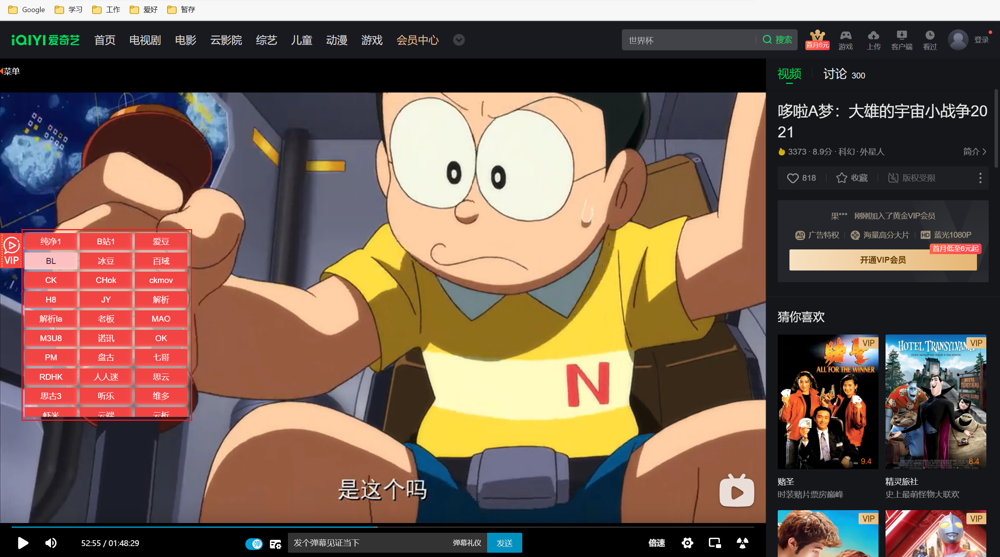

### 油猴脚本安装简述

第一步，下载谷歌/edge浏览器。

第二步，下载tampermonkey。

第三步，下载的油猴文件(或者直接试用如下方式安装)，解压后得到的.crx文件拖拽到谷歌/edge浏览器的扩展管理页面（打开开发者模式）即可完成安装。

## 安装步骤

### 安装油猴扩展

由于考虑到一些同学没有ti子，下文以Edge浏览器（内核Chrome）举例，谷歌浏览器也是大同小异。

1、点击[获取 Microsoft Edge 扩展](https://microsoftedge.microsoft.com/addons?hl=zh-CN)，打开开发者模式。

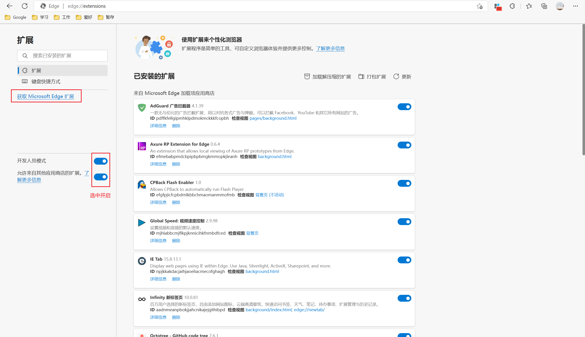

2、跳转至扩展获取界面，热门中如有直接点击获取即可

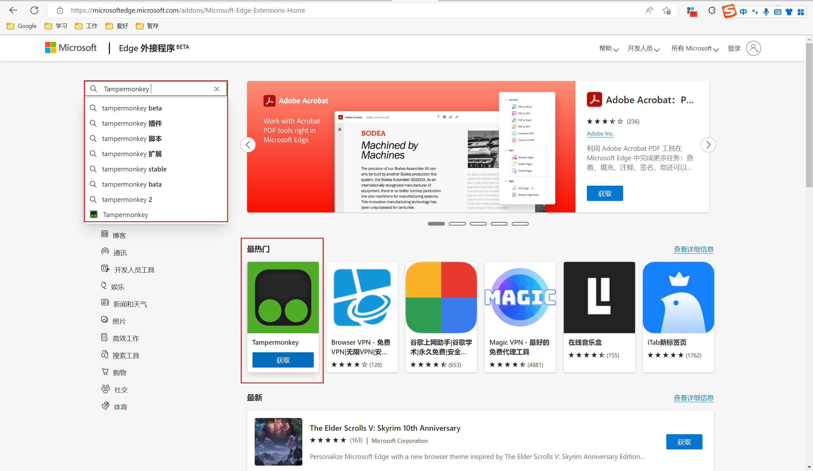

或者搜索**Tampermonkey**，搜索到油猴之后点击获取。

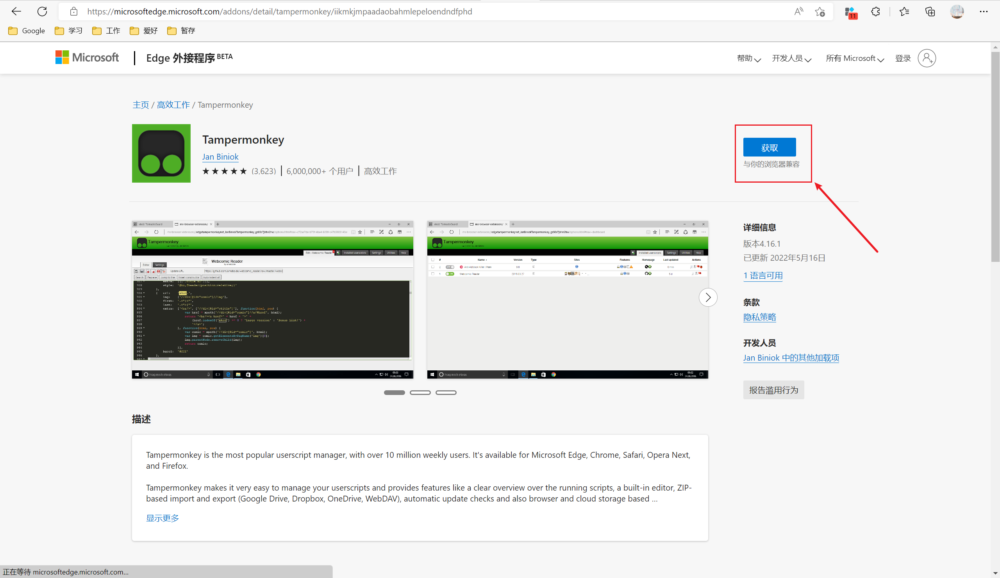

3、弹出添加扩展添加即可。

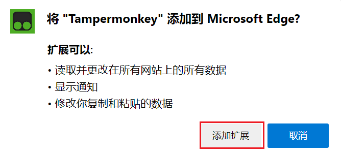

4、添加成功会出现**Tampermonkey** 已经成功安装!会跳转到此页面。

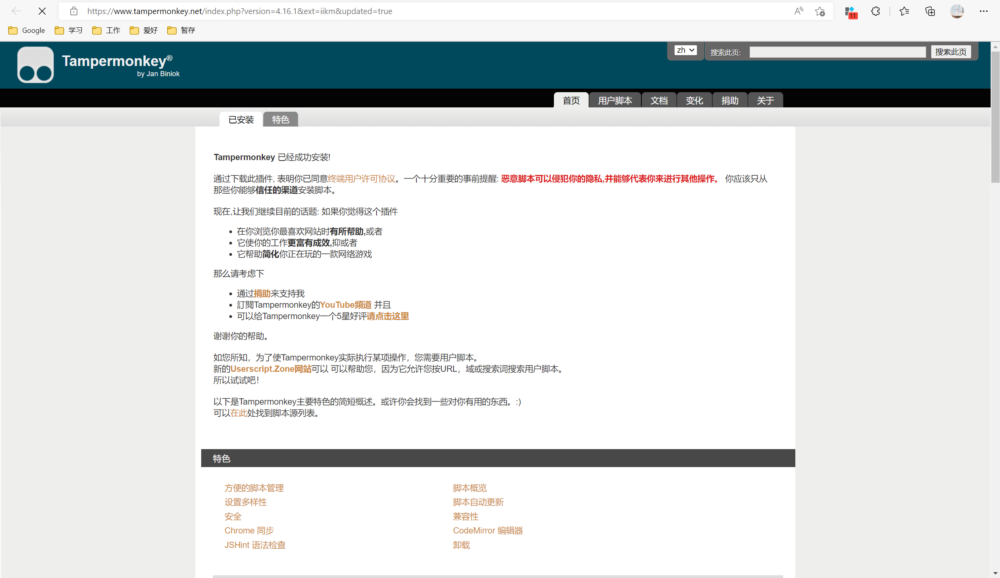

5、点击用户脚本，有几种获取脚本的方式，笔者一般使用第二种[GreasyFork](https://greasyfork.org/)去获取。

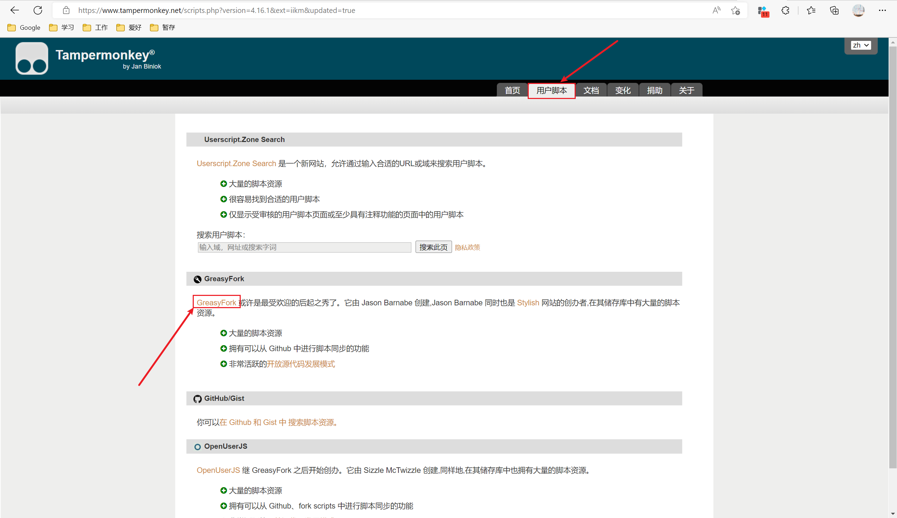

可以看到有脚本使用安装简单介绍：

第一步：安装一个用户脚本管理器

第二步：安装一个用户脚本

第三步：使用用户脚本

到此第一步我们已经完成，接下来就是安装用户脚本了。

6、也可便捷三步安装油猴，点击传松门，[Tampermonkey • 首页](https://www.tampermonkey.net/)，点击下载直接省略上文1、2、3步骤。以上省略步骤是为了方便用户可以自行安装其他扩展。下文会简单推荐个人好用扩展。

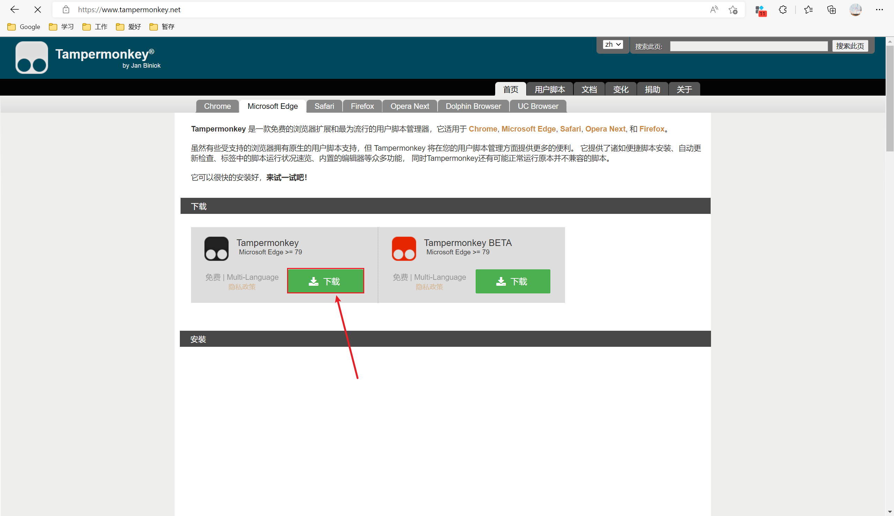

### 安装用户脚本

1、点击[GreasyFork](https://greasyfork.org/)去获取，首页如图：

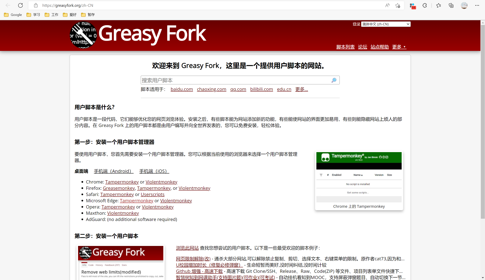

2、搜索框输入脚本名称，支持模糊查询如直接搜索视频（下文以此举例），选择自己所需脚本点击进入安装界面。

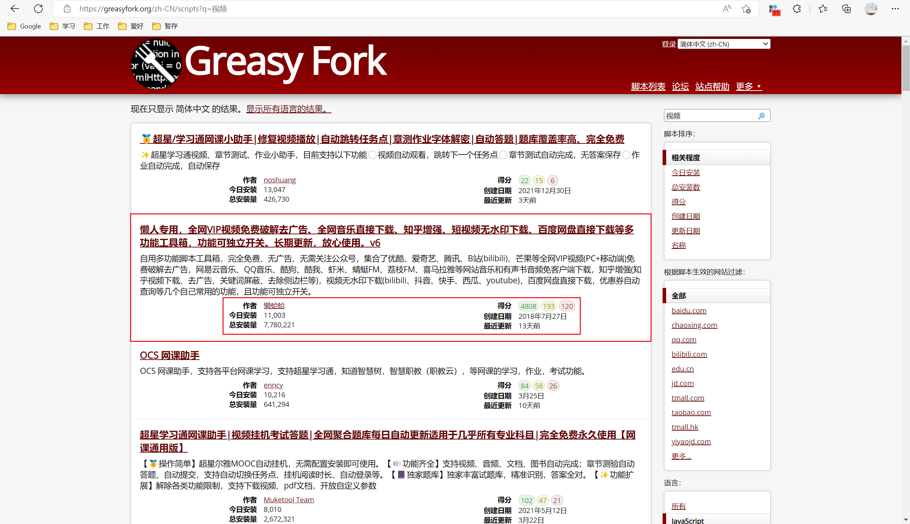

3、点击安装此脚本即可。

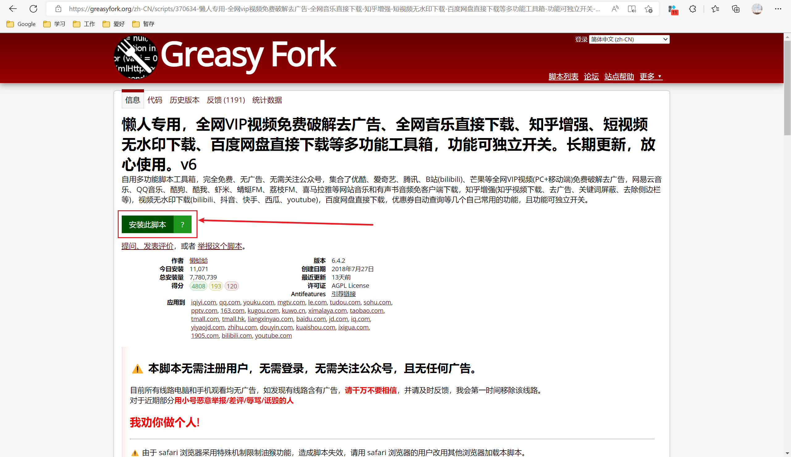

4、然后点击管理面板即可查看到刚刚安装的脚本。建议之前先把油猴扩展展示，方便后续操作。

油猴扩展展示进行如下操作，点击隐藏标识取消隐藏。

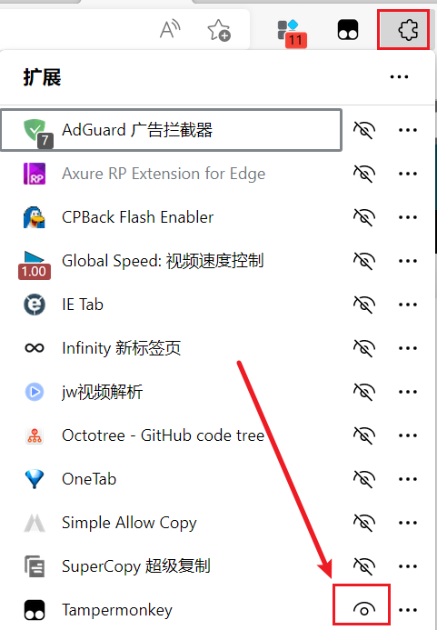

鼠标左击油猴扩展标识，点击管理面板

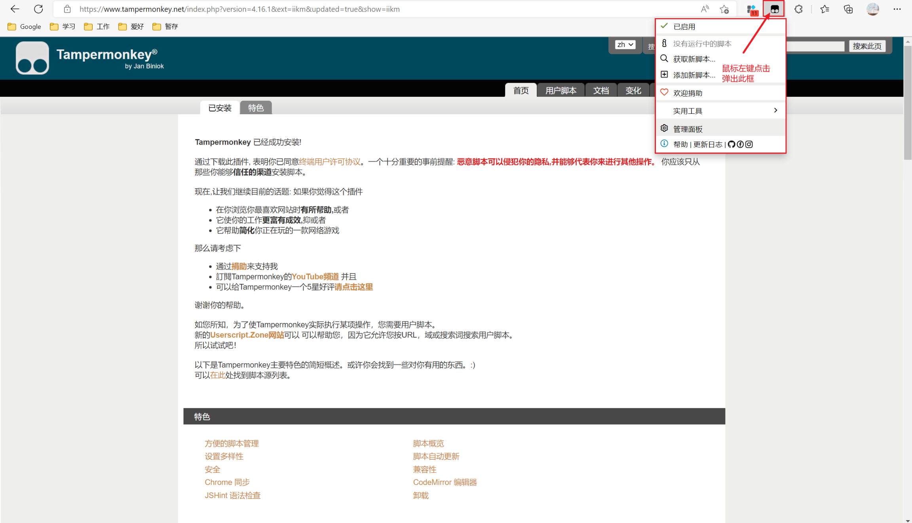

5、即可进入管理面板，可以查看到已经安装的脚本列表，默认已经启用。

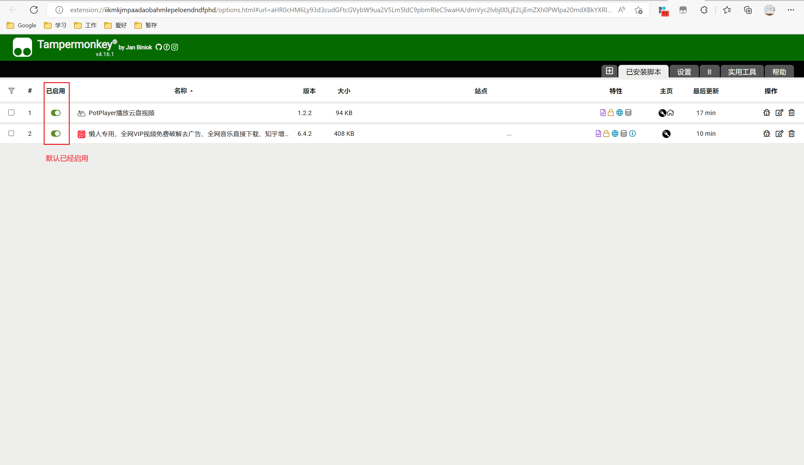

### 使用方法

打开你想看的视频，发现左边有按钮，点击后展开选择其中一个解析地址稍等片刻，如有解析失败的接口，更换接口即可。

- 全网VIP视频破解去广告免费看+全网音乐下载+知乎增强+短视频无水印下载效果图

  
- B站哔哩哔哩使用增强，全网VIP视频免费破解去广告，全网音乐直接下载xxx效果图

  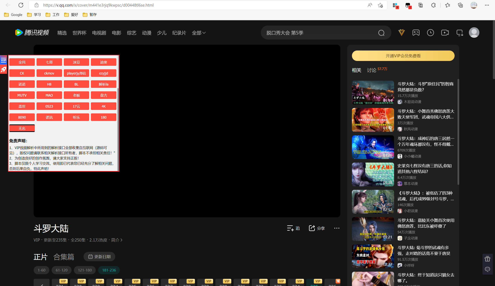

## 扩展、脚本推荐

### 油猴脚本推荐

- 计时器掌控者|视频广告跳过|视频广告加速器
-  懒人专用，全网VIP视频免费破解去广告、全网音乐直接下载、知乎增强xxx
- B站哔哩哔哩使用增强，全网VIP视频免费破解去广告，全网音乐直接下载xxx
- 百度网盘视频播放尊享 VIP | 解锁视频倍数 | 解锁全部清晰度

### Chrome/Edge扩展推荐

- Infinity 新标签页
- OneTab
- Tampermonkey
- 扩展管理器（Extension Manager）
- AdBlock/AdGuard
- 沙拉查词-聚合词典划词翻译
- NeatDownloadManager Extension
- SuperCopy 超级复制

  开发者推荐

- GitCodeTree
- Octotree - GitHub code tree
- FeHelper(前端助手)
