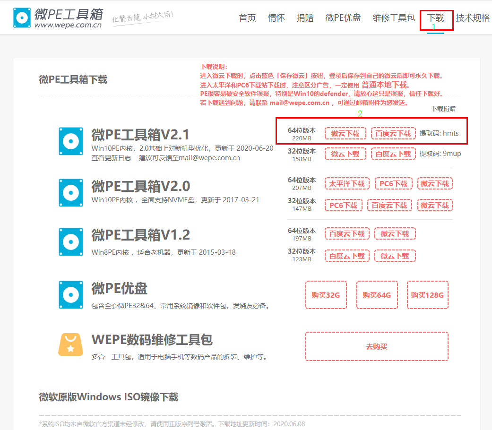
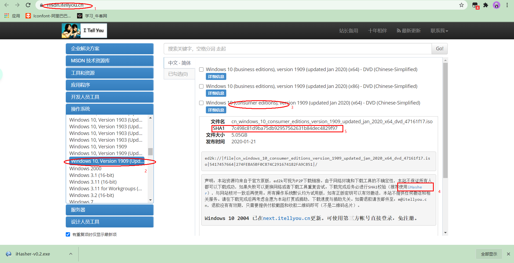
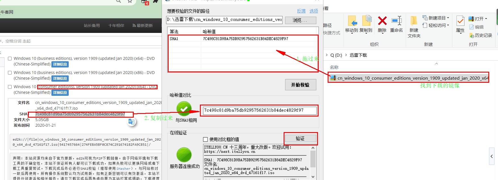
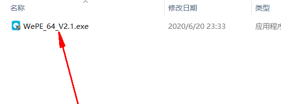
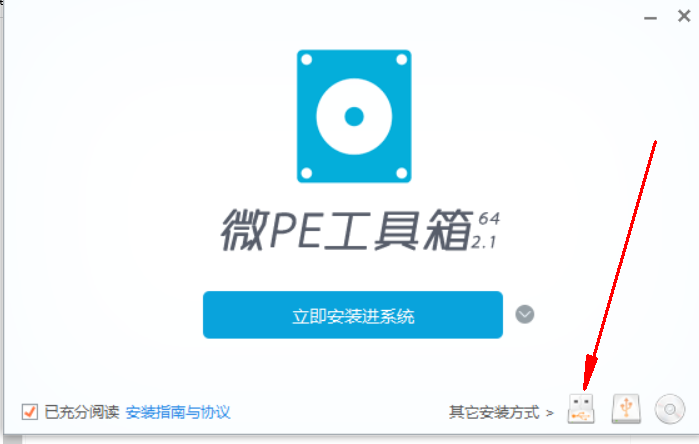
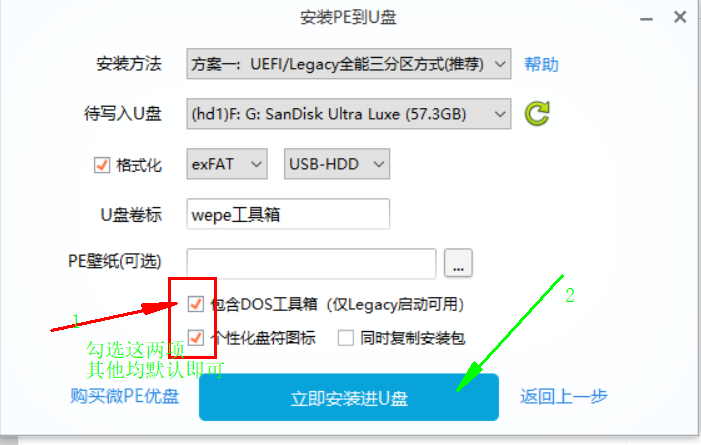

**第一步：制作前期准备**

* 16 GB 以上的U盘

* 微 PE 工具箱 exe 文件

* 系统镜像（官方渠道/MSDN）

[微PE官网](https://www.wepe.com.cn/download.html)
如下图所示下载微 PE 工具箱 exe 文件本地

[MSDN 镜像下载](https://msdn.itellyou.cn/)

建议采用哈希比对下载，直接下载到 U 盘里，防止文件下载等传输出错，下载完成后然后进行哈希比对。

**第二步：制作U盘启动盘**

双击 exe 文件

设置安装方式（本文选取安装到 U 盘）

进行简单设置，安装即可。

