## 背景

通过一篇技术文 看到 Alibaba Java 技术图谱，就点进去看看大佬都学了哪些东西以及进阶路线，于是就点开一个课程，提示我注册账号，顺手就注册一把，之前就留意有羊毛可以薅，不过都给错过了，一看新用户免费白嫖一个月多种服务任选。看到阿里云 云服务器ECS 可以白嫖一个月，参数都没看，果断直接点进来。订单如下。

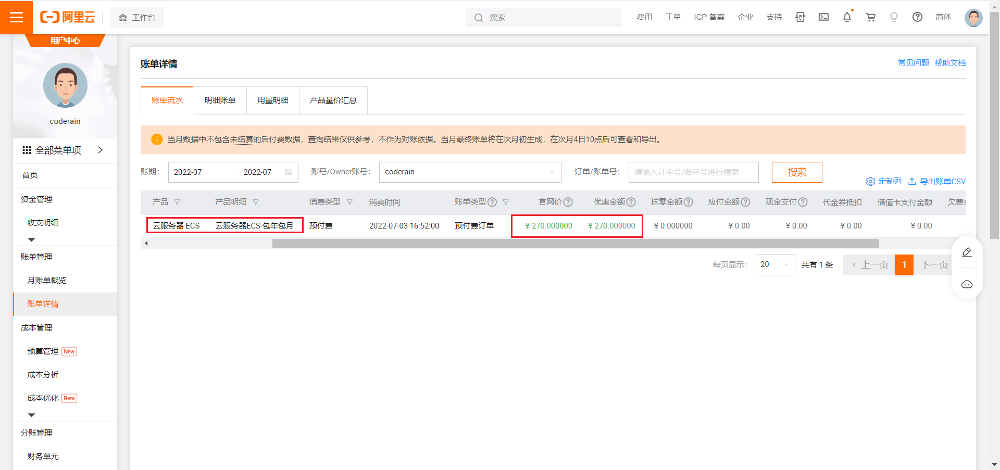

接下来使用一个月来简单玩玩这个东西。

## 初探索

首先留下两行血泪，选好cpu、内存、带宽，地域是非常重要的。其他可以默认选择。地域之前听说过买海外的不要备案，但是是白嫖就随便点了个华东地区，还要备案很头秃。

**1、登陆控制台**

其次探索一下登陆控制台，输入账号密码，进去看到服务界面，新手可能刚开始很蒙。

操作如下，点击左侧菜单，

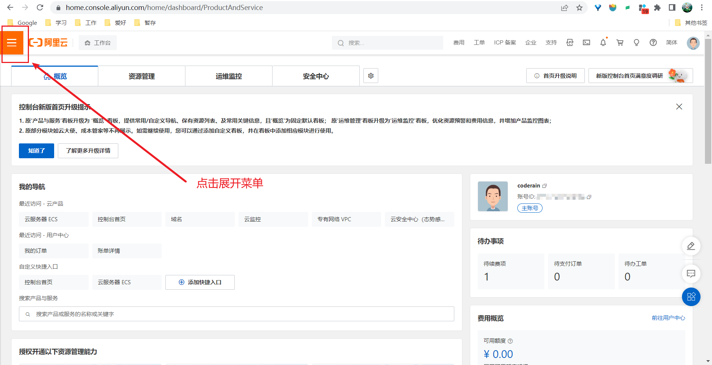

点击购买的云服务器，

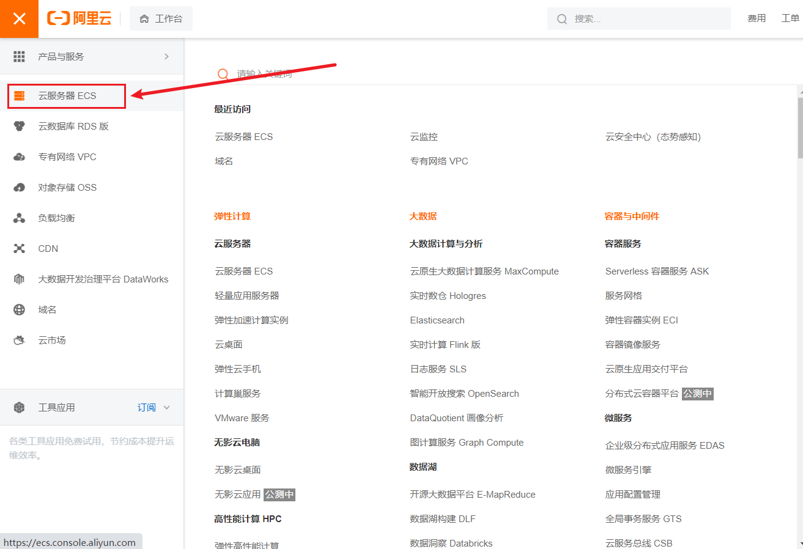

显示界面如图：

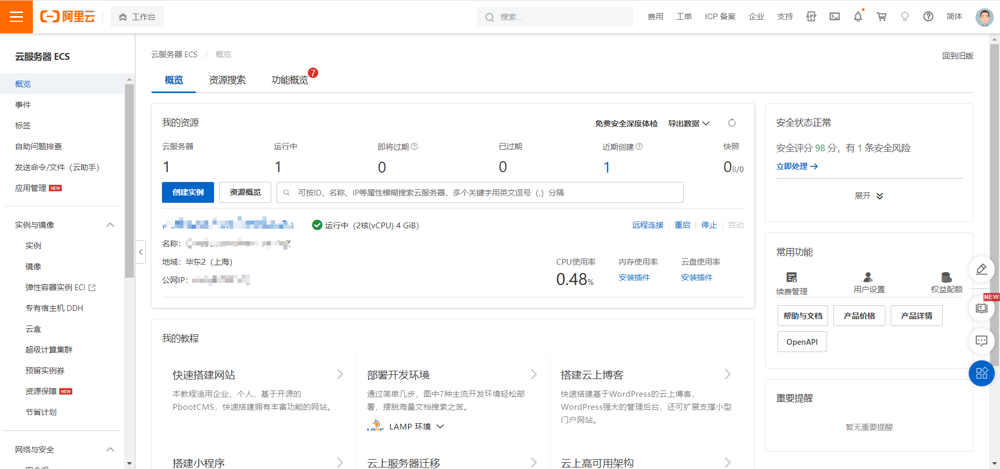

**2、简单配置**

首先点击实例，点击创建实例，选择区域，一定要选对地域才能看到服务器。

创建后可以尝试登录了，登录前有几个参数查看或者修改一下。

其一连接密码修改

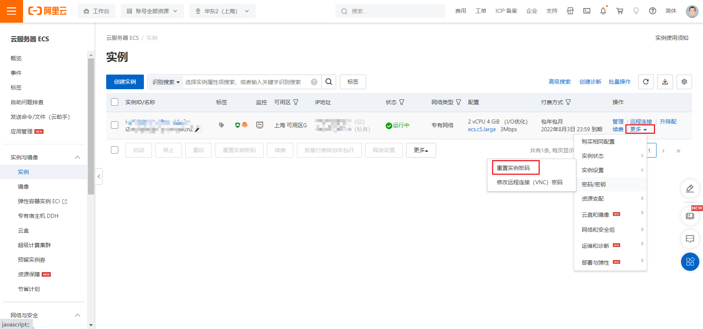

其二操作系统查看一下是否是自己熟悉，停止运行的服务器，可以在更多配置修改。

其三添加常用安全组端口

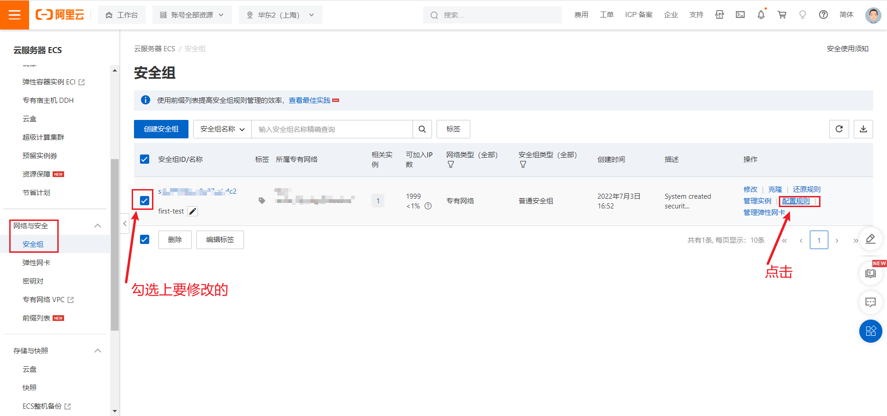

建议直接点击快速添加把常用端口如 80，3306，6379，22 等添加上。

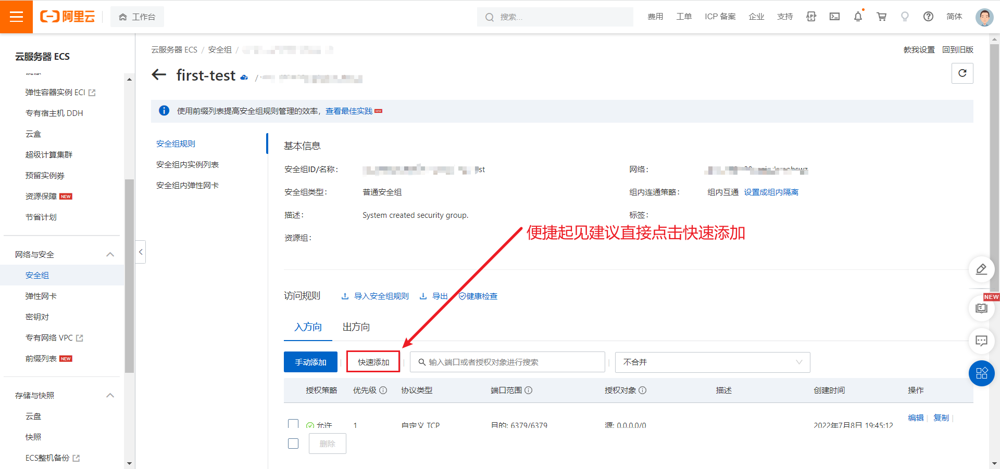

## 连接搞机

### Alibaba Cloud Shell（显而易见阿里云命令行面板）

点击菜单栏云命令行

即可进入命令行界面
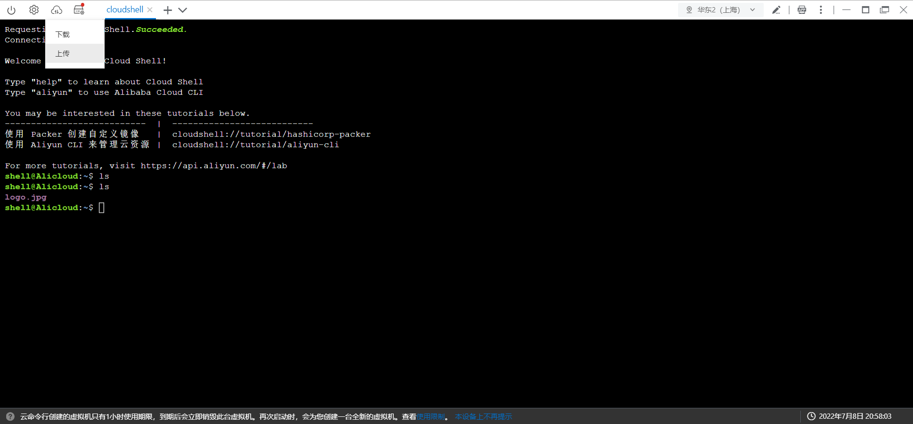

上传文件也很方便有图形化界面。

### xshell连接

### 宝塔面板

**1、宝塔安装**

服务器上安装宝塔，不用 Linux 命令行，直接可视化安装一些环境真的太爽了。

宝塔官网安装教程:https://www.bt.cn/admin/servers 给出了详细教程，总结下来就简单三步

- 注册宝塔账号

- 阿里云服务器上打开宝塔使用的安全组 8888 端口

- 服务器上安装宝塔

  未安装宝塔之前使用xshell 或者阿里云命令行连接上服务器，输入`yum install -y wget && wget -O install.sh http://download.bt.cn/install/install_6.0.sh && sh install.sh ed8484bec `（Centos安装脚本 ，由于我的服务器安装的操作系统是Centos，接下来不在做说明，其他安装命令看宝塔官网安装教程）

  下载完成后会有如下面板地址以及用户名和密码。打开网址输入用户名密码登陆即可。

  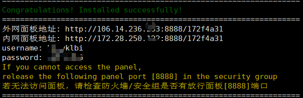

**2、宝塔使用**

打开网址输入用户名密码登陆后，会提示绑定宝塔面板以及界面化推荐下载到服务器上一些环境如MySQL，nodes，nginx，按提示操作即可。

登录后界面如图

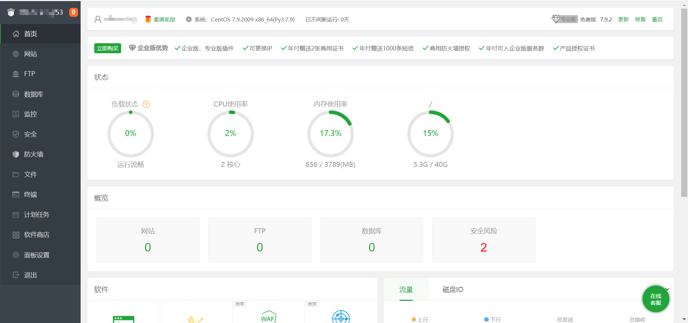

## 踩坑

1、背景

前一天在宝塔面板如下位置修改了安全入口，然后忘记了。

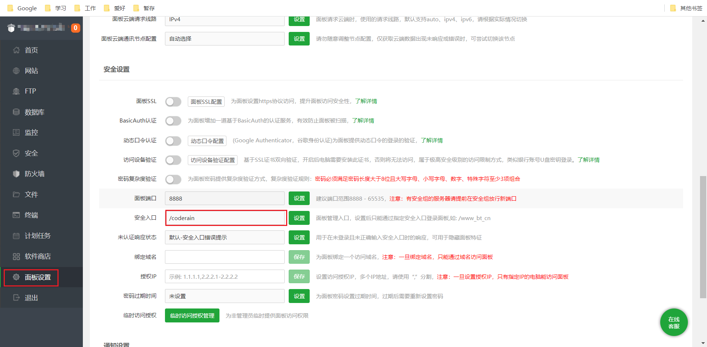

2、报错

http://1xx.xx.xx.xx:8888/原来安全入口

访问此修改前地址后报错：安全入口校验失败

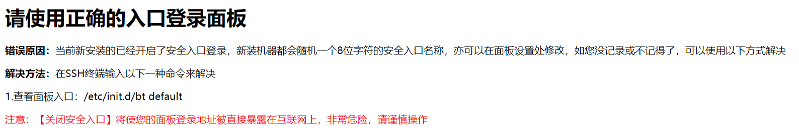

3、解决方案

按照提示修改即可，就是连接上服务器输入`/etc/init.d/bt default`即可查看安全入口地址。

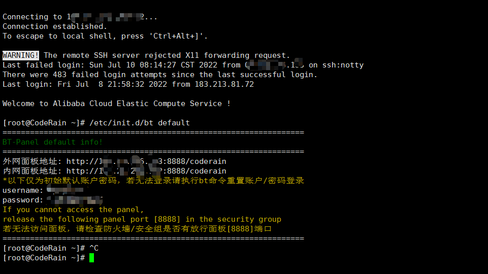
